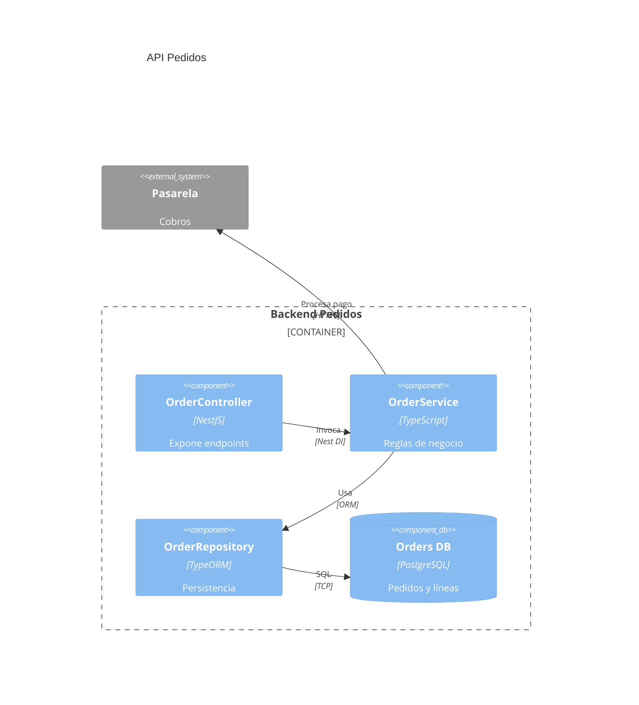
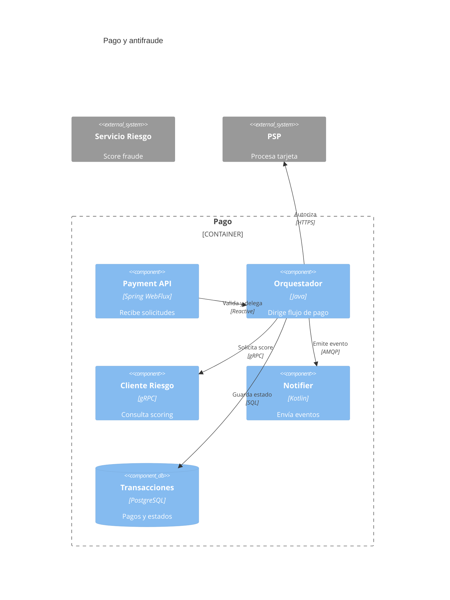
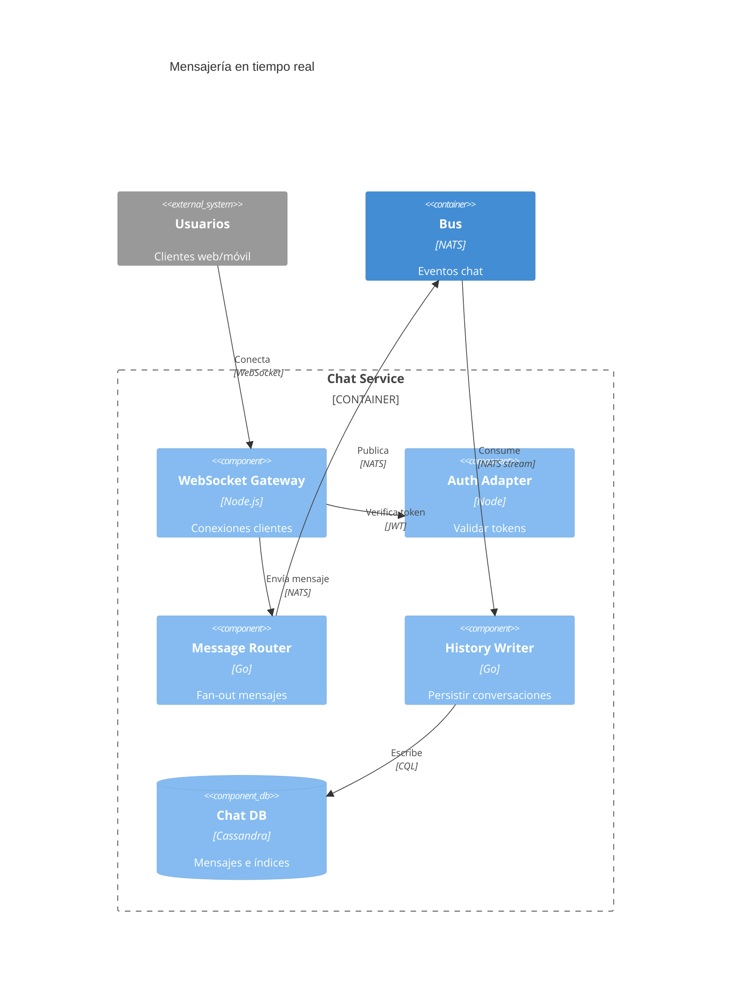
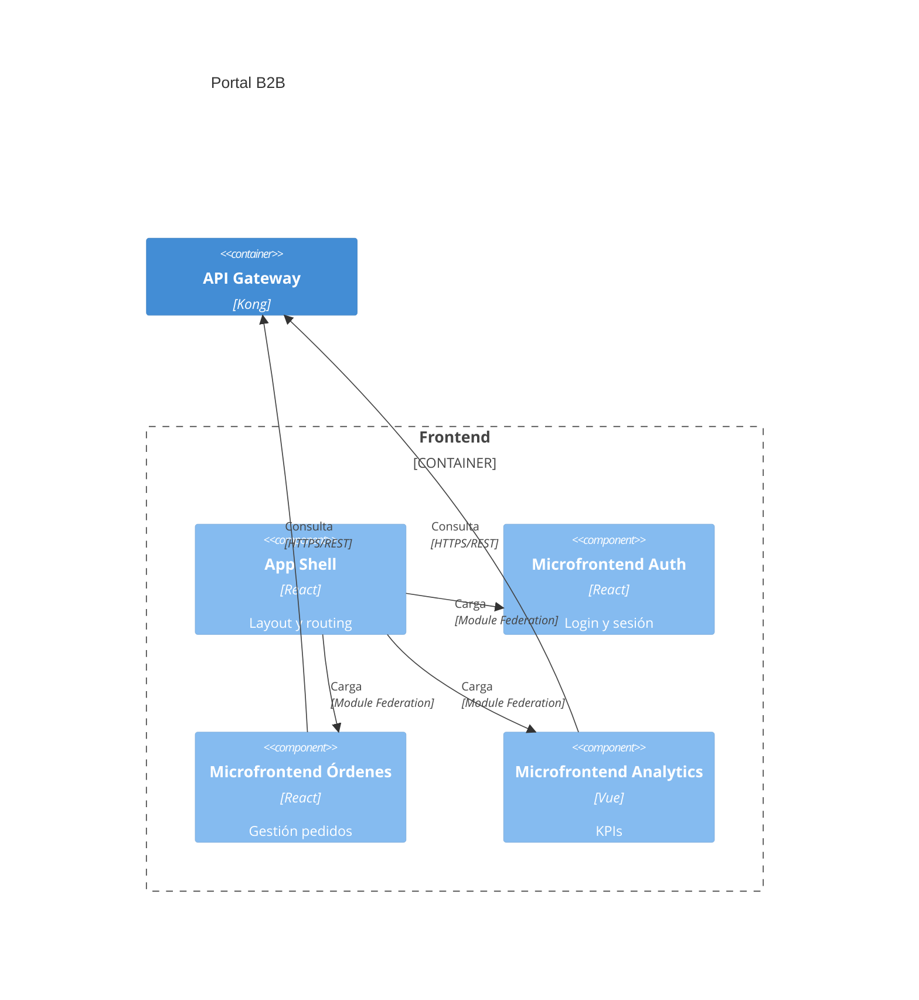
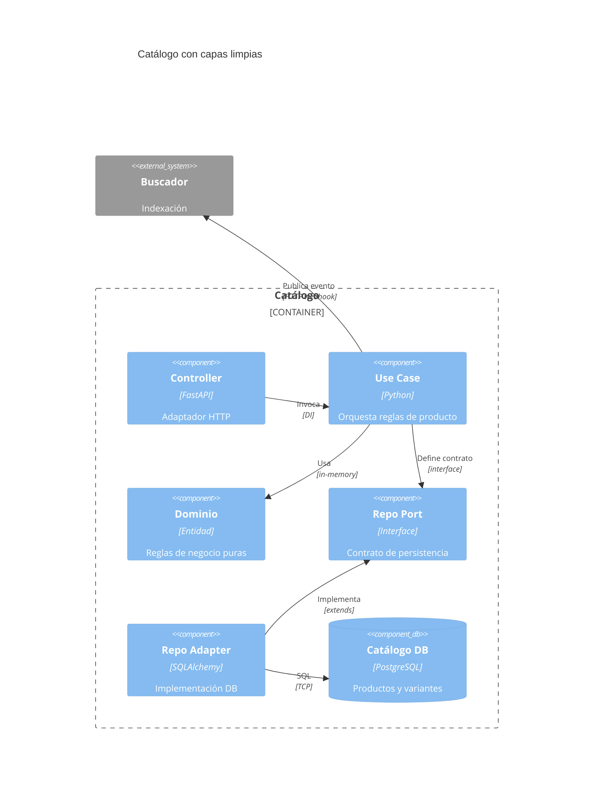
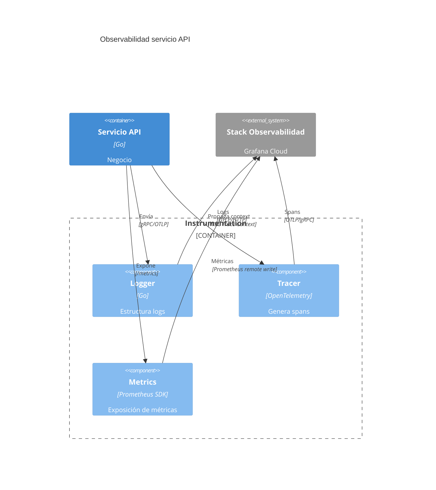

# Diagramas C4 Component en Mermaid

Los diagramas `C4Component` (nivel 3) detallan la estructura interna de un contenedor: controladores, servicios, adaptadores y cómo colaboran.

## Sintaxis básica
- Encabezado: `C4Component`.
- Contenedor padre (opcional pero recomendado): `Container_Boundary(id, "Nombre") { ... }` para agrupar componentes.
- Componentes: `Component(alias, "Etiqueta", "Tecnología", "Responsabilidad")` y `ComponentDb(alias, "Etiqueta", "Tecnología", "Responsabilidad")`.
- Sistemas externos y contenedores adyacentes: `System_Ext` o `Container` según corresponda para dejar claro el contexto.
- Relaciones: `Rel(origen, destino, "Tipo", "Protocolo")`.

## Errores comunes
- No declarar el contenedor padre, dejando componentes flotando sin contexto.
- Reutilizar alias de contenedores en componentes, generando colisiones.
- Falta de responsabilidades o tecnología en componentes, impidiendo distinguir roles.
- Relaciones sin protocolo que dificultan validar dependencias.

## Ejemplos

### API REST modular (baseline)

### Microservicio de pagos con antifraude

### Plataforma de mensajería con colas y websockets

### Frontend modular con micro-frontend

### Clean Architecture para backend de catálogo

### Observabilidad y tracing del servicio

## Buenas prácticas
- Mantén la vista dentro de un contenedor: usa límites claros para evitar mezclar niveles.
- Explica responsabilidad y tecnología en cada componente; evita nombres genéricos.
- Incluye adaptadores (web, colas, batch) y puertos (interfaces) para mostrar dependencias explícitas.
- Muestra dependencias externas (PSP, búsqueda, observabilidad) con `System_Ext` o `Container` para dejar claro el contexto.
- Valida en Mermaid Live Editor: cada `Rel` necesita etiqueta y protocolo para legibilidad.
