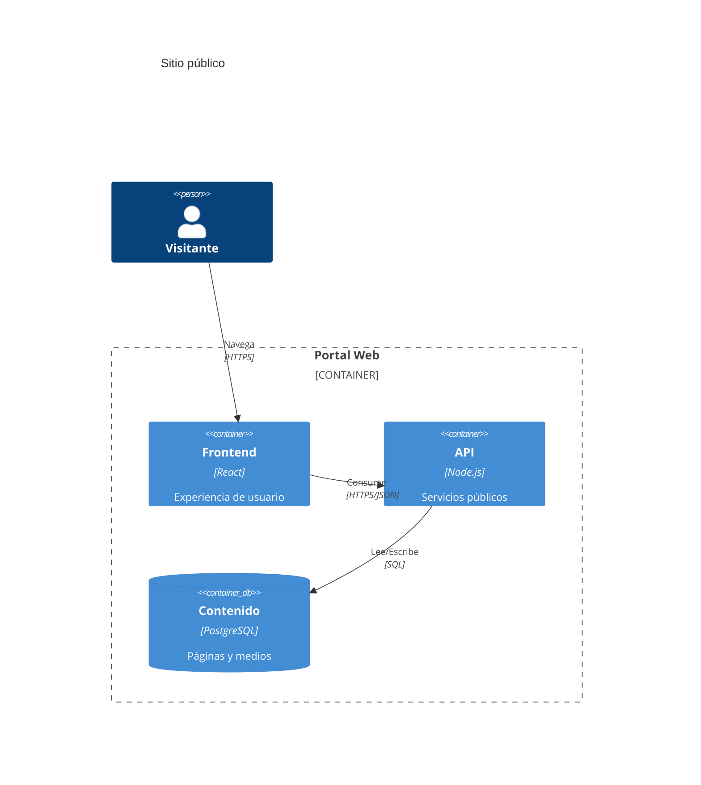
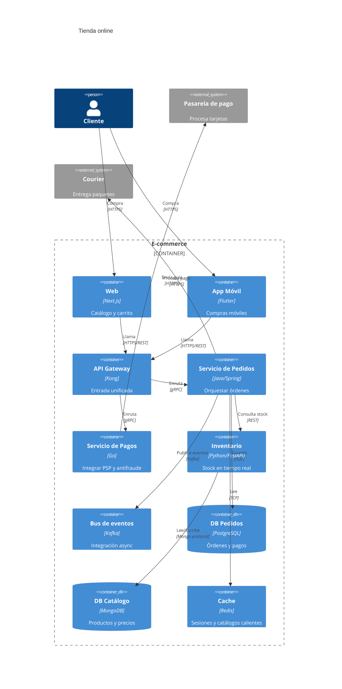
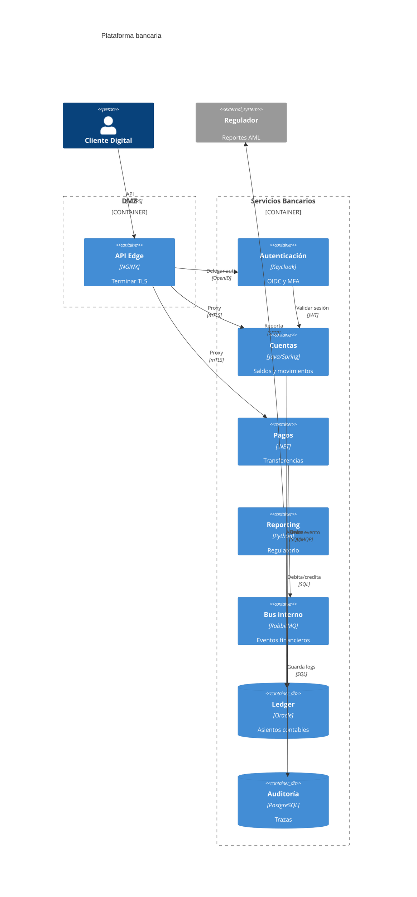
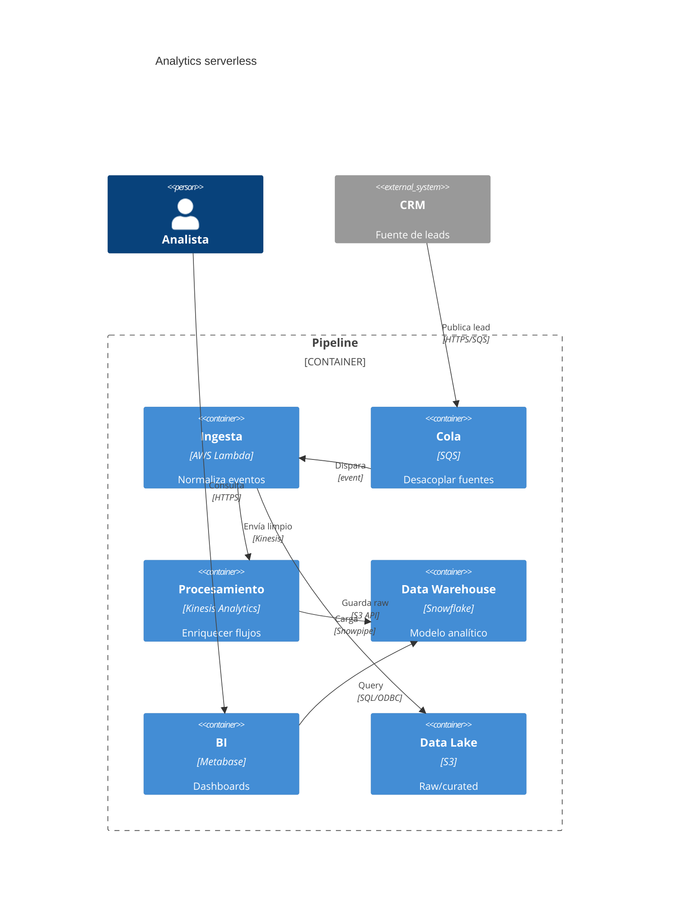
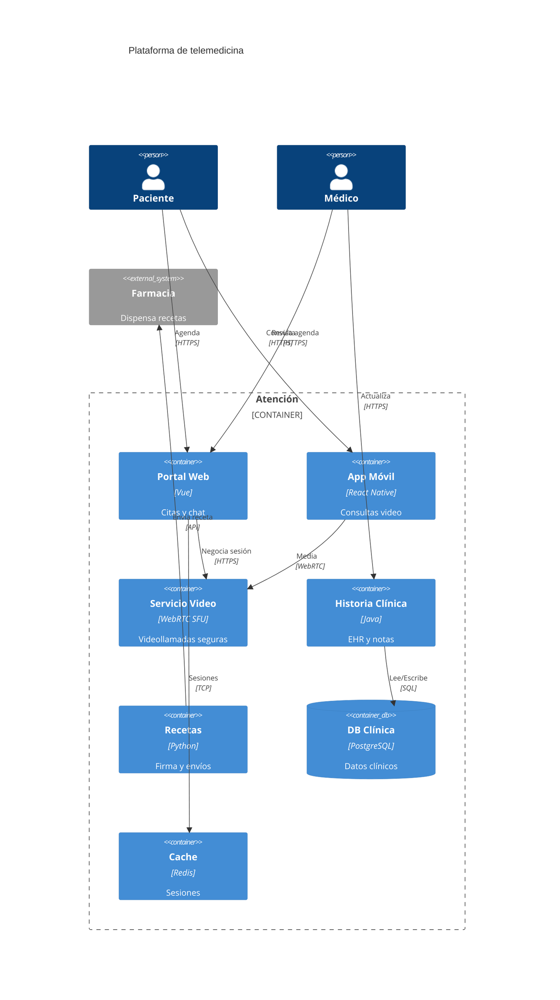
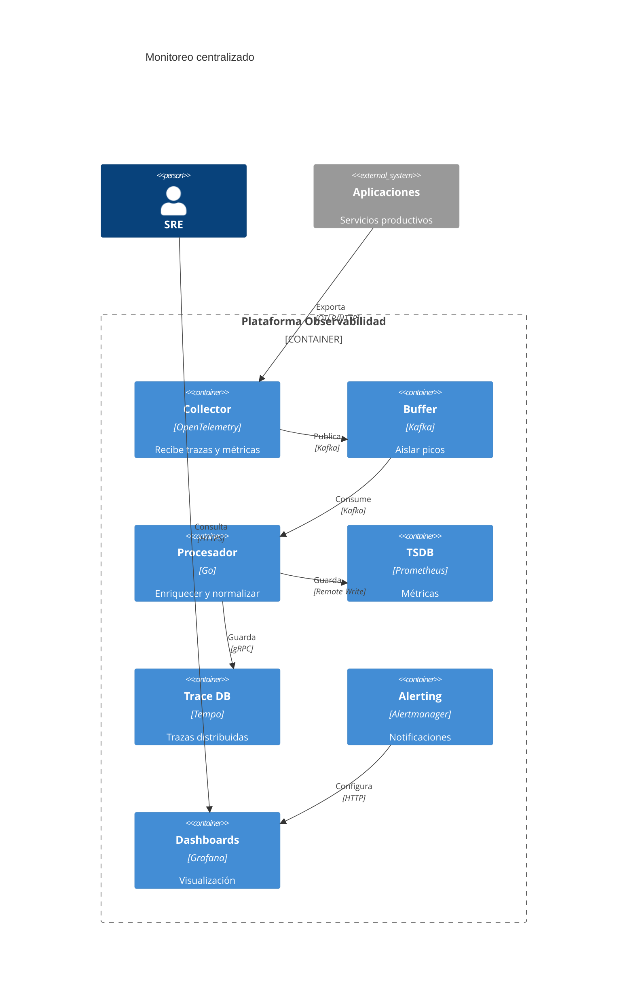

# Diagramas C4 Container en Mermaid

Los diagramas `C4Container` muestran las aplicaciones y bases de datos que conforman un sistema (nivel 2) y cómo se comunican.

## Sintaxis básica
- Encabezado: `C4Container`.
- Personas y sistemas externos: `Person(alias, "Etiqueta", "Descripción")`, `System_Ext(alias, "Etiqueta", "Descripción")`.
- Contenedores: `Container(alias, "Etiqueta", "Tecnología", "Responsabilidad")` y `ContainerDb(alias, "Etiqueta", "Tecnología", "Responsabilidad")`.
- Límites: `System_Boundary` o `Container_Boundary(id, "Nombre") { ... }` para agrupar contenedores relacionados.
- Relaciones: `Rel(origen, destino, "Tipo", "Protocolo")`.

## Errores comunes
- Dejar contenedores sin especificar tecnología/responsabilidad.
- Olvidar agrupar en límites cuando hay más de un contenedor por sistema.
- Etiquetas de relación vacías o sin protocolo (dificulta lectura).
- Reutilizar el mismo alias en distintos límites.

## Ejemplos

### Básico: SPA y API

### E-commerce en microservicios con límites claros

### Core bancario con zonas seguras

### Arquitectura serverless orientada a datos

### Telemedicina multicanal

### Observabilidad y seguridad agregadas

## Buenas prácticas
- Siempre etiqueta tecnología y responsabilidad para cada contenedor.
- Usa límites (`Container_Boundary`) para separar dominios (tienda, pagos, seguridad).
- Prefiere protocolos explícitos en `Rel` (HTTPS, gRPC, AMQP, SQL).
- Añade caches, colas o buses cuando haya integración asíncrona para reflejar acoplamiento.
- Valida los diagramas en Mermaid Live Editor antes de usarlos en documentación.
