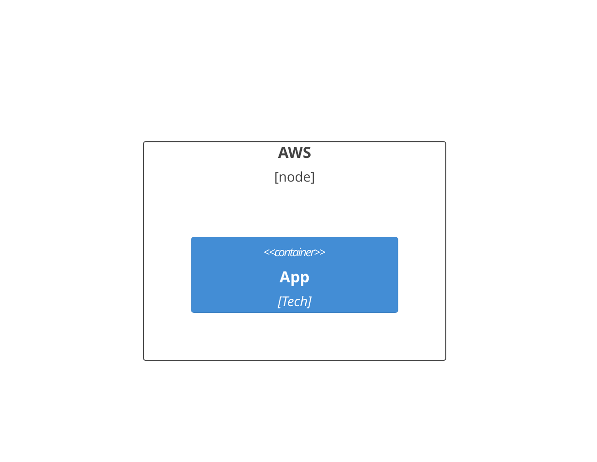
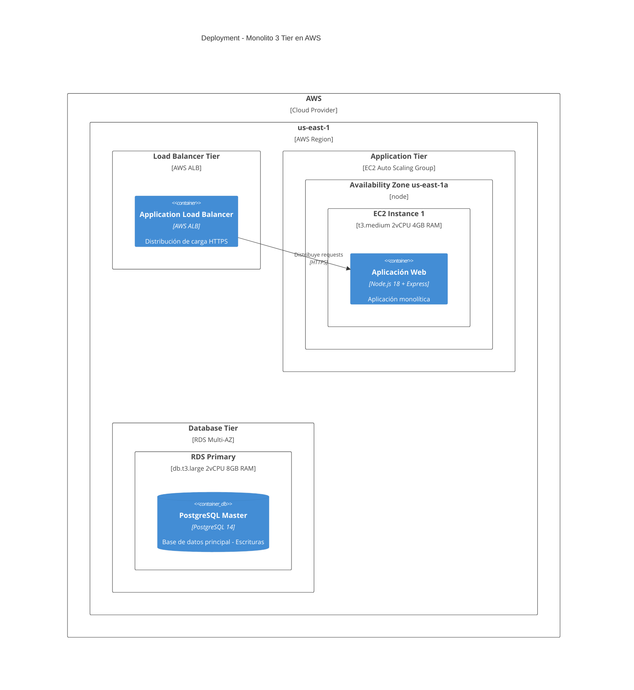
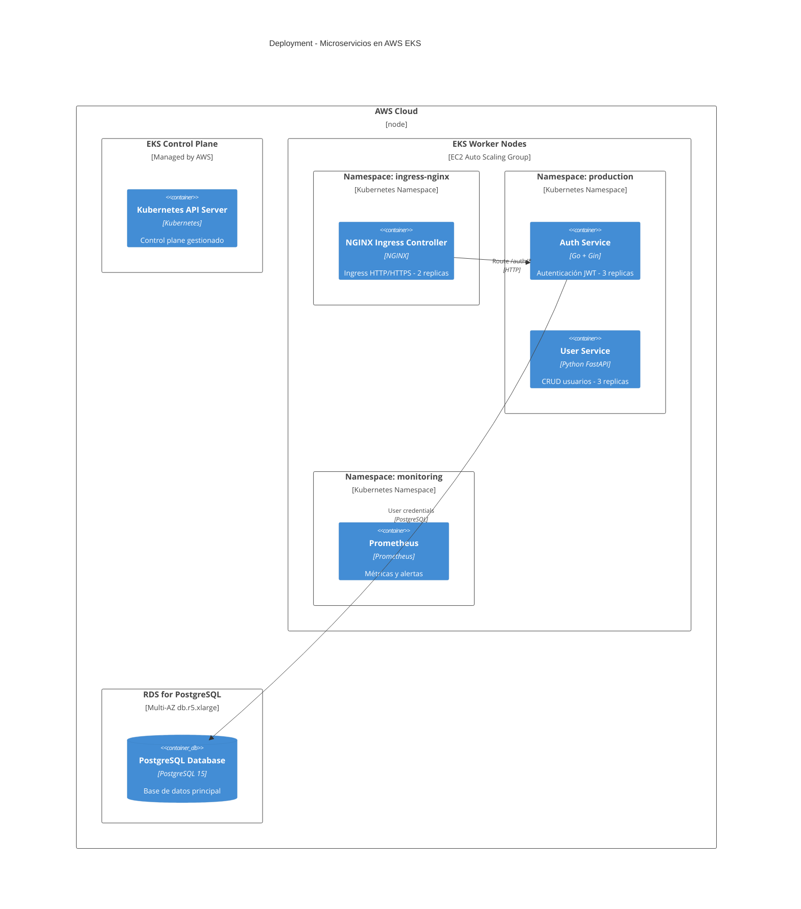
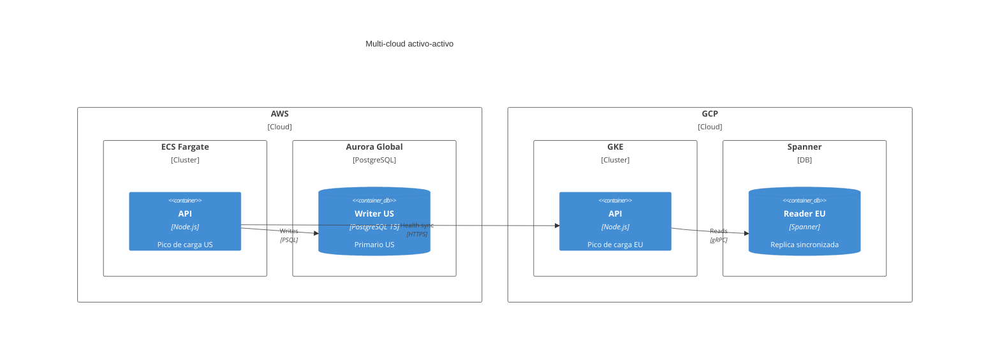
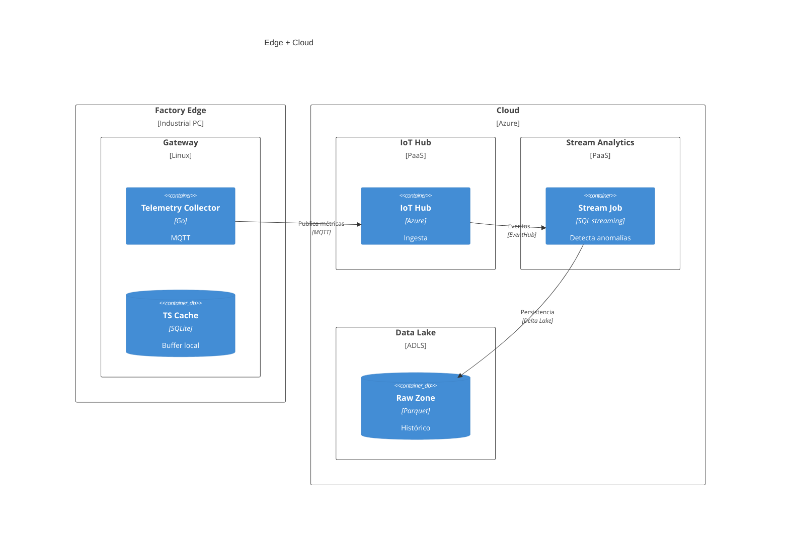

# Diagramas C4 Deployment en Mermaid

## Sintaxis Básica (Oficial + Original Verificada)
`C4Deployment`. Nodos: Deployment_Node(alias, "Label", "Type") { ... }. Contenedores: Container(alias, "Label", "Tech").

- Regla absoluta: Deployment_Node siempre con {} y al menos un hijo.
- No usar Node() solo; siempre con contenedor.

## Errores Más Comunes (Del Original)
- Deployment_Node sin {} o hijo: "Expecting 'LBRACE'".
- Llaves no balanceadas: "Parse error - Expecting '}'".
- Usar Node(): "Unknown diagram type".
- Relaciones a Deployment_Node en lugar de Container.

## Patrones Anti-Error (❌ vs ✅)
- ❌ `Deployment_Node(edge, "Edge")` sin hijo → ✅ añade al menos un `Container` interno.
- ❌ Relacionar `Rel(aws, app, ...)` usando nodos → ✅ `Rel(app, db, ...)` relaciona contenedores.
- ❌ Mezclar `Deployment_Node` y `ContainerDb` sin cerrar llaves → ✅ valida balanceo `{` `}` y anidación clara.
- ❌ Repetir alias en distintos niveles → ✅ alias únicos por nodo/contendedor.
- Checklist rápido: cada Deployment_Node tiene hijo, llaves balanceadas, relaciones solo entre Containers/ContainerDb, alias únicos, título opcional al inicio.

## Ejemplos
### Simple

### Medio

### Complejo

### Multi-cloud Activo-Activo (Industria: Fintech)

### Edge + Cloud para IoT Industrial

## Buenas Prácticas
- Siempre incluye hijos en Deployment_Node.
- Usa jerarquía: Cloud > Region > AZ > Server > Container.
- Del original: Verifica llaves balanceadas; relaciones a Containers no Nodes.
- Métricas: Capas <5; conexiones seguras 100%.
- Troubleshooting: revisa alias únicos, balanceo de llaves y que todas las relaciones usen contenedores; valida en Mermaid Live Editor.