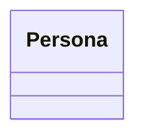
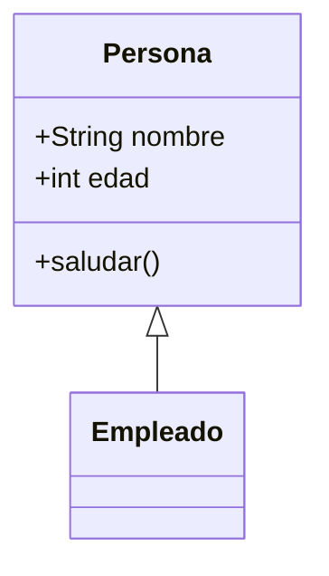
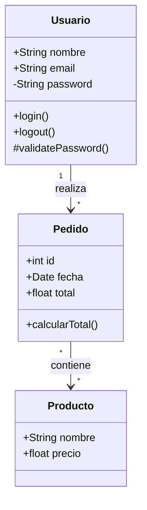
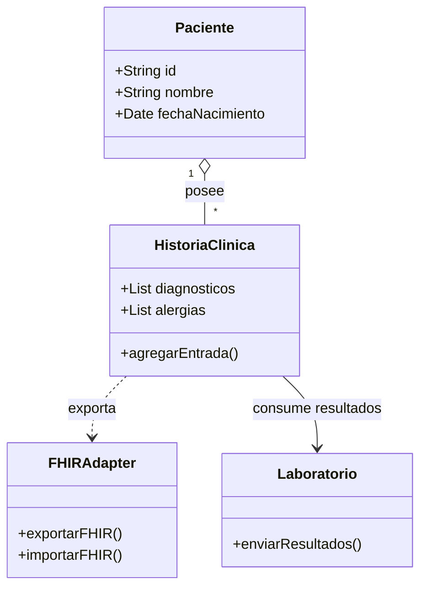
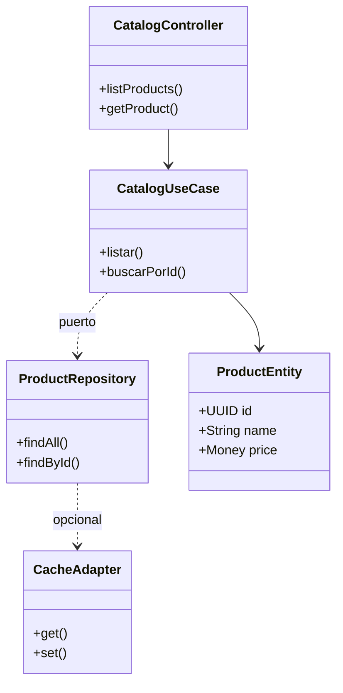
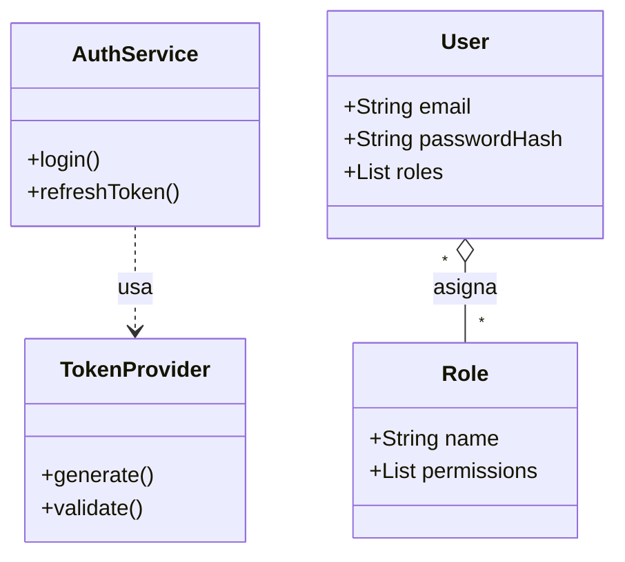

# Diagramas de Clases (UML) en Mermaid

## Sintaxis Básica
Inicia con "classDiagram". 
Clases: class [Nombre] { +Atributo -Método() }. 
Relaciones: <|-- herencia, *-- composición.

- Del original: Visibilidad +/-/#/ ~.

## Visibilidad y Clasificadores
- `+` Público, `-` Privado, `#` Protegido, `~` Package.
- `*` Abstracto, `$` Estático.

## Tipos de Relaciones (Corregida: Oficial + Original)
| Sintaxis   | Relación      | Uso                                                                 |
|------------|---------------|---------------------------------------------------------------------|
| `<\|--`   | Herencia     | Subclase hereda de superclase (e.g., `Animal <\|-- Duck`: Duck hereda de Animal). |
| `*--`      | Composición  | Parte fuerte de un todo; la parte no existe sin el todo (e.g., `Car *-- Engine`). |
| `o--`      | Agregación   | Parte débil de un todo; la parte puede existir independientemente (e.g., `Team o-- Player`). |
| `-->`      | Asociación dirigida | Una clase usa o se relaciona con otra en una dirección específica (e.g., `Person --> Address`). |
| `..>`      | Dependencia  | Una clase depende de otra temporalmente (e.g., `ClassA ..> ClassB`: cambios en B afectan A). |
| `..\|>`   | Realización  | Una clase implementa una interfaz (e.g., `Class ..\|> Interface`). |
| `--`       | Asociación no dirigida | Conexión general entre clases sin dirección específica (e.g., `ClassA -- ClassB`). |

## Cardinalidad
`A "1" --> "0..*" B : tiene`

## Errores Más Comunes
- Visibilidad no especificada.
- Relaciones invertidas.
- Clases sin llaves {} para miembros.
- Nombres duplicados.
- Usar -- para asociaciones sin cardinalidad.

## Patrones Anti-Error (❌ vs ✅)
- ❌ `class A { atributo }` (sin tipo/visibilidad) → ✅ `class A { +String atributo }` (explícito y consistente).
- ❌ `A -- B` cuando es herencia → ✅ `A <|-- B` para mantener semántica UML.
- ❌ Cardinalidad fuera de comillas `1..*` → ✅ `"1" --> "1..*"` (comillas dobles en ambos lados).
- ❌ Reutilizar alias de clase → ✅ Nombres únicos y en PascalCase.
- Checklist rápido: visibilidad en atributos/métodos, cardinalidad con comillas, relaciones correctas (herencia vs asociación), clases agrupadas por responsabilidad.

## Ejemplos
### Simple

### Medio

### Complejo

### Healthcare - Historia clínica interoperable

### E-commerce - Clean Architecture en catálogo

### Seguridad - Autenticación y RBAC

## Buenas Prácticas
- Usa SOLID principles.
- Evita herencia profunda.
- Modela clases con atributos/métodos claros.
- Métricas: <15 clases; profundidad herencia.
- Troubleshooting: valida que cada relación use el operador correcto, agrega comillas a cardinalidades y revisa llaves de clases para evitar errores de parseo.