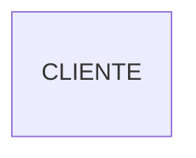
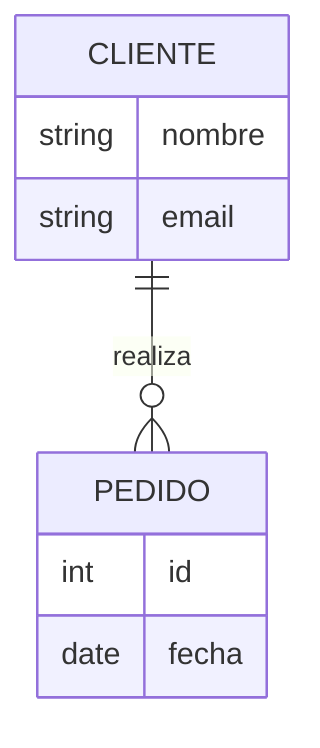
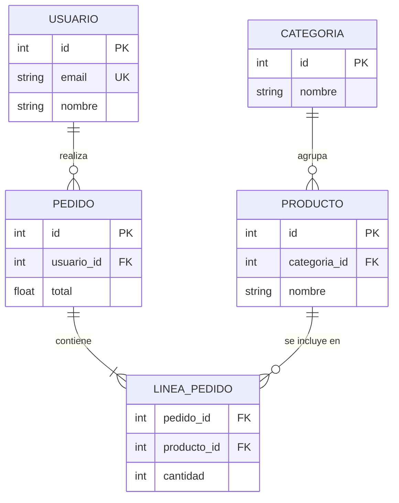
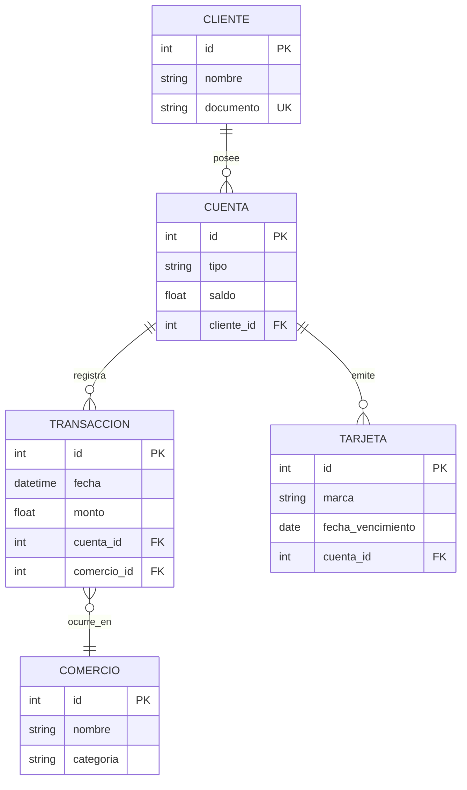
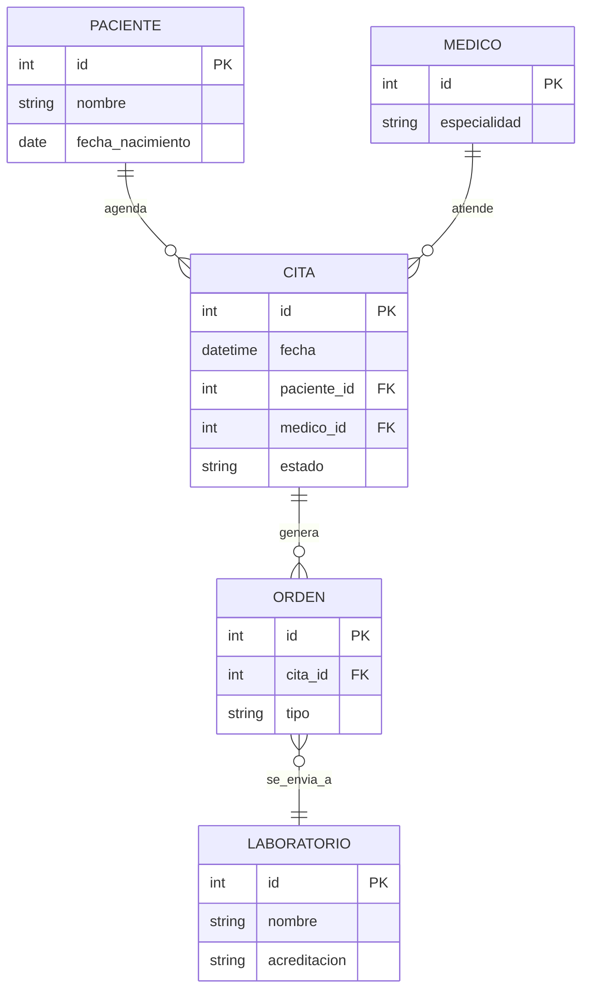
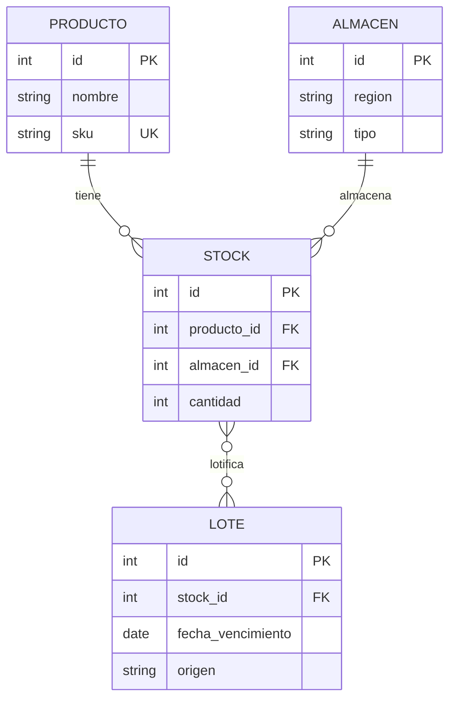

# Diagramas Entidad-Relación (E-R) en Mermaid

## Sintaxis Básica
Inicia con "erDiagram". 
Entidades: [Nombre] { tipo campo }. 
Relaciones: ||--o{ para 1 a muchos, con : "etiqueta".

## Cardinalidad (Oficial + Original)
- `||--||` : Uno a Uno
- `||--o{` : Uno a Muchos
- `}o--o{` : Muchos a Muchos

## Errores Más Comunes
- Relaciones sin etiqueta (: "rol").
- Tipos de datos inválidos (sin string/int).
- Cardinalidad incorrecta.
- Entidades sin campos.
- Del PDF: Relaciones no normalizadas.

## Patrones Anti-Error (❌ vs ✅)
- ❌ `CLIENTE ||-- PEDIDO` (falta cardinalidad completa) → ✅ `CLIENTE ||--o{ PEDIDO : realiza`.
- ❌ Campos sin tipo `string`/`int` → ✅ `string nombre`, `int id PK`.
- ❌ Repetir comillas o caracteres especiales en nombres → ✅ Alias en mayúsculas sin espacios (usa guiones bajos).
- ❌ Relaciones sin dirección semántica → ✅ Etiquetas verbales (`: envía`, `: factura`).
- Checklist: cardinalidades cerradas, tipos explícitos, llaves PK/FK indicadas, relaciones con verbo.

## Ejemplos
### Simple (Oficial)

### Medio (Del Original + PDF)

### Complejo (Del Original)

### Banca - Cuentas y transacciones

### Salud - Agenda y órdenes médicas

### Supply Chain - Inventario multi almacén

## Buenas Prácticas
- Claves primarias/foráneas claras.
- Normalización (3NF).
- Asegura integridad referencial.
- Métricas: <10 entidades; relaciones descriptivas 100%.
- Troubleshooting: verifica que cada relación tenga verbo, cardinalidad completa y que todas las FK estén declaradas en la entidad hija para evitar errores de parseo.