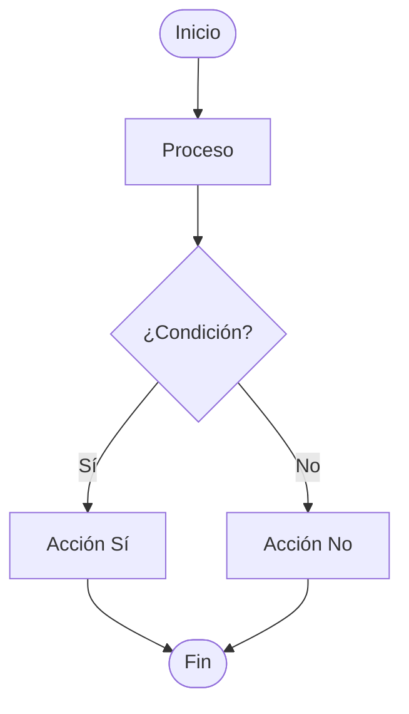
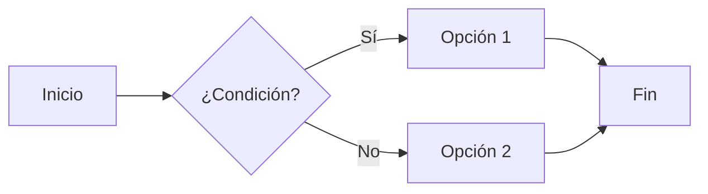
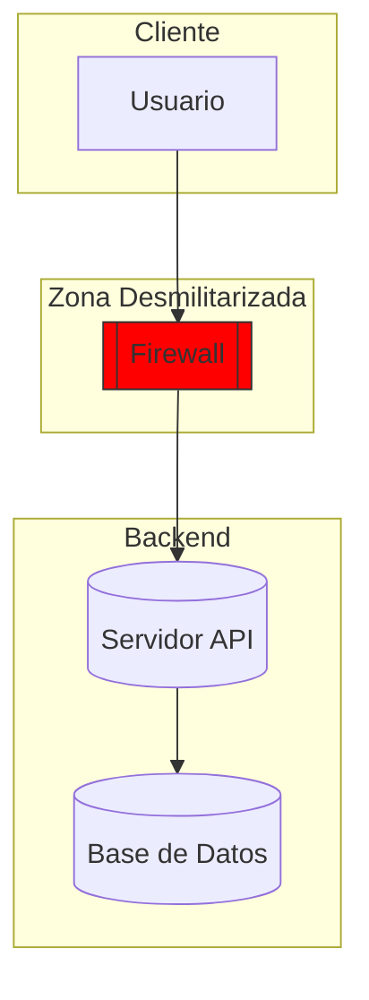
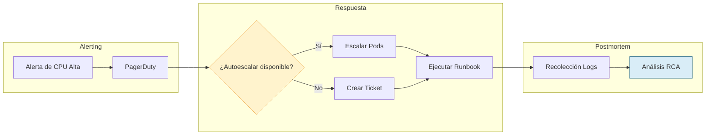
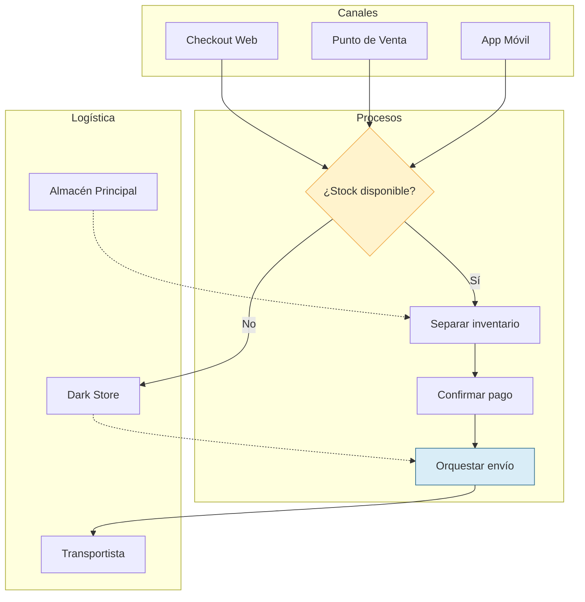
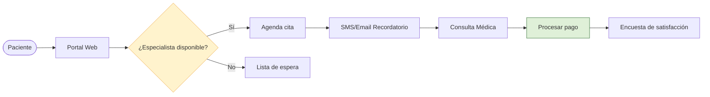

# Diagramas de Flujo (Flowcharts) en Mermaid

## Sintaxis Básica
Se definen con "flowchart" seguido de la dirección (e.g., LR para izquierda-derecha, TB para arriba-abajo). Nodos: [Etiqueta] para rectángulos, {Etiqueta} para decisiones. Conexiones: --> para flechas, -- Etiqueta --> para etiquetadas.

- Del documento original: Usa TD/LR/BT/RL para dirección.
- Oficial: `graph` es alias de `flowchart`.

## Tipos de Nodos (Oficial + Complemento)
| Sintaxis | Resultado | Uso |
|----------|-----------|-----|
| `[Texto]` | Rectángulo | Proceso estándar |
| `([Texto])` | Extremos redondeados | Inicio/Fin |
| `{Texto}` | Rombo | Decisión |
| `{{Texto}}` | Hexágono | Preparación |
| `[(Texto)]` | Cilindro | Base de datos |
| `((Texto))` | Círculo | Conector |
| `[/Texto/]` | Paralelogramo | Entrada/Salida |
| `[Texto]` | Trapecio | Manual |
| `A@{ shape: rect, label: "Text" }` (v11.3+) | Formas expandibles | Personalizado (e.g., circle, diamond) |

## Tipos de Conexiones (Oficial + Original)
- `A --> B`  – Flecha sólida
- `A --- B`  – Línea sin flecha
- `A -.-> B` – Flecha punteada
- `A ==> B`  – Flecha gruesa
- `A -->|texto| B` – Con etiqueta
- `A o--o B` – Círculo en extremos
- `A x--x B` – Cruz en extremos

## Subgrafos (Del Original + Oficial)
Usa `subgraph [Título]` para agrupar, con `end` para cerrar.

## Errores Más Comunes
- Indentación inconsistente: Debe ser uniforme (4 espacios).
- Dirección no especificada: Default TD, pero explícita es mejor.
- Nodos sin cierre: Olvidar ] o }.
- Flechas sin conexión clara: A --> B no definido.
- "end" en minúsculas: Usa "End" o workaround.
- Especiales como "o" o "x" primero: Añade espacio o capitaliza.
- Del PDF: Subgraphs sin end; iconos no cerrados.

## Patrones Anti-Error (❌ vs ✅)
- ❌ `flowchart TD\nA-->B` (sin espacios, difícil de leer) → ✅ `flowchart TD\n    A --> B` (sangría consistente).
- ❌ `A-->B-->` (flecha huérfana) → ✅ `A --> B` (si no hay destino, convierte en nota o elimina).
- ❌ `subgraph Zona` sin `end` → ✅ `subgraph Zona\n    ...\nend` (valida subgrafos balanceados).
- ❌ `A -- Texto B` (texto sin delimitadores) → ✅ `A -- Texto --> B` (usa `-->` o `---`).
- Checklist rápido: dirección definida, llaves/corchetes balanceados, subgrafos cerrados, flechas con origen y destino existentes.

## Ejemplos
### Simple

### Medio

### Complejo

### Operaciones - Respuesta a incidentes (Industria: Observabilidad)

### Retail Omnicanal (Industria: E-commerce)

### Salud - Gestión de citas (Industria: Healthcare)

## Buenas Prácticas

- Comienza simple, añade complejidad si necesario.
- Usa etiquetas descriptivas en nodos/conexiones.
- Aplica estilos (colores, iconos) para claridad.
- Verifica conexiones lógicas.
- Usa subgraphs para agrupar componentes; considera audiencia para detalle.
- Métricas: <10 nodos para simplicidad; complejidad ciclomatica <5.
- Troubleshooting: valida con Mermaid Live Editor, busca flechas huérfanas y subgrafos sin `end`, confirma que cada decisión tiene salidas etiquetadas.