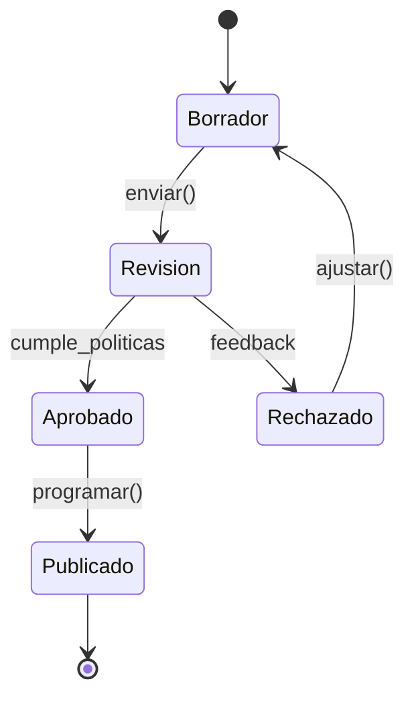
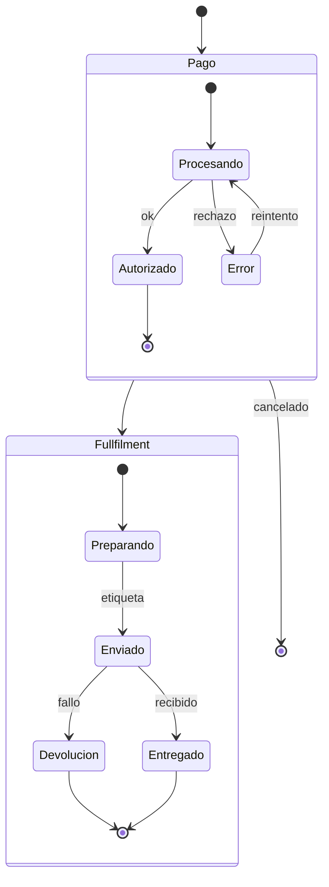
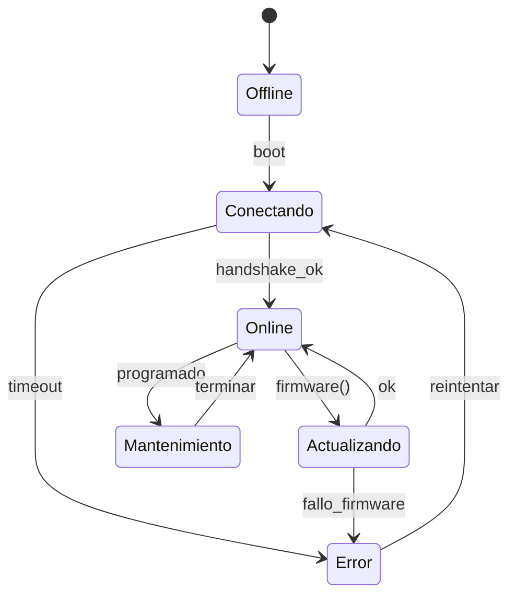
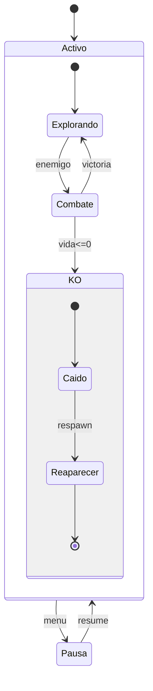
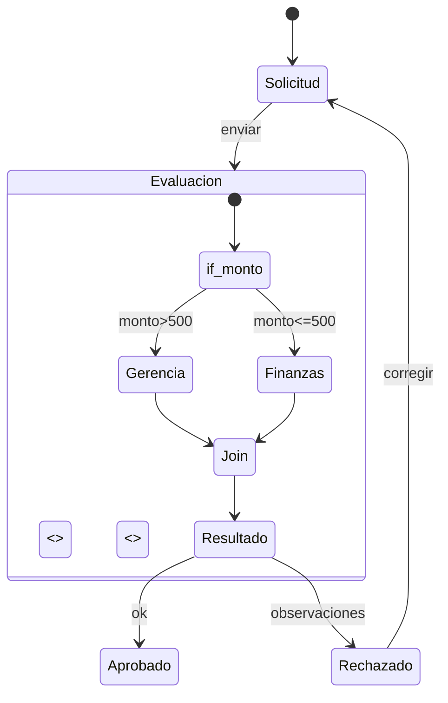
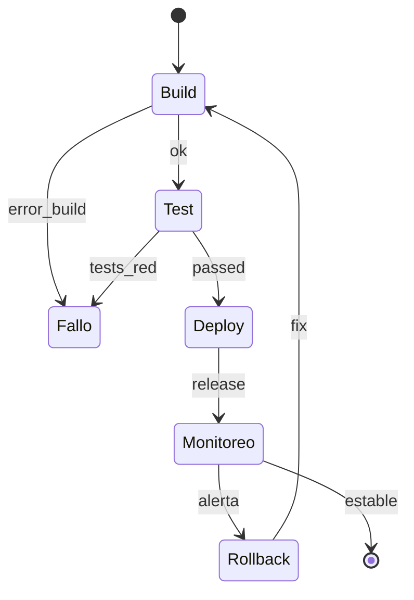

# Diagramas de Estado en Mermaid

Los diagramas `stateDiagram-v2` permiten modelar lifecycles, ramificaciones y paralelismos. Usa siempre la versión `-v2` para compatibilidad.

## Sintaxis y notas clave
- Inicio/Fin: `[*] --> Estado` y `Estado --> [*]`.
- Transiciones: `Origen --> Destino : evento/condición`.
- Compuestos: `state "Nombre" { ... }` para anidar.
- Paralelo: `<<fork>>` para dividir y `<<join>>` para sincronizar.
- Decisión: `<<choice>>` para ramas condicionales.

### Errores frecuentes
- Olvidar `stateDiagram-v2` o cerrar llaves de estados compuestos.
- Transiciones sin etiqueta que dificultan lectura.
- Dead-ends sin camino a fin o sin estados de error.
- Reutilizar el mismo alias con mayúsculas/minúsculas cambiadas.

## Ejemplos específicos

### Workflow de aprobación de contenido (empresarial)

Puntos clave: incluye loop de corrección y transición explícita a publicación.

### Pedido e-commerce con estados paralelos

Puntos clave: dos subprocesos paralelos (pago y entrega) con rutas de error.

### Ciclo de vida de dispositivo IoT

Puntos clave: incluye timeouts y reintentos automáticos.

### Personaje de videojuego con estados anidados

Puntos clave: estados anidados para KO y transición de pausa global.

### Sistema de aprobación de gastos con choice/join

Puntos clave: ramas condicionales con `choice` y sincronización posterior.

### Proceso de CI/CD simplificado

Puntos clave: incluye rollback y bucle de mejora continua.

## Buenas prácticas
- Siempre muestra un camino feliz y al menos un camino de error.
- Prefiere nombres de estados verbales/claros y eventos en minúsculas con guiones bajos.
- Limita la profundidad de anidación a 2-3 niveles para mantener legibilidad.
- Verifica que cada fork tenga un join o un estado terminal claro.
