# Diagramas de User Journey

Los diagramas de `journey` en Mermaid permiten mapear experiencias de usuario con métricas de satisfacción paso a paso. Usa sangrías con espacios (no tabs) y mantén puntuaciones de 1 a 5.

## Sintaxis completa
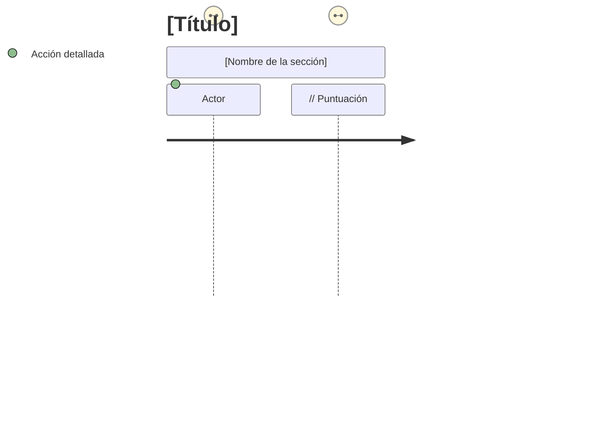

### Errores comunes a evitar
- Omitir `journey` como palabra clave inicial.
- Usar tabs en lugar de espacios (rompe el render).
- Puntuaciones fuera de 1-5 o sin número.
- Falta de secciones: todos los pasos deben estar anidados en `section`.
- Repetir actores con mayúsculas/minúsculas distintas generando dos entidades.

## Ejemplos progresivos
Cada ejemplo sigue la plantilla recomendada: título claro, secciones con contexto y puntuaciones realistas.

### Nivel: Simple - Login web
**Descripción**: Flujo mínimo de autenticación.
**Complejidad**: Simple
**Elementos clave**: credenciales válidas, recuperación de cuenta.
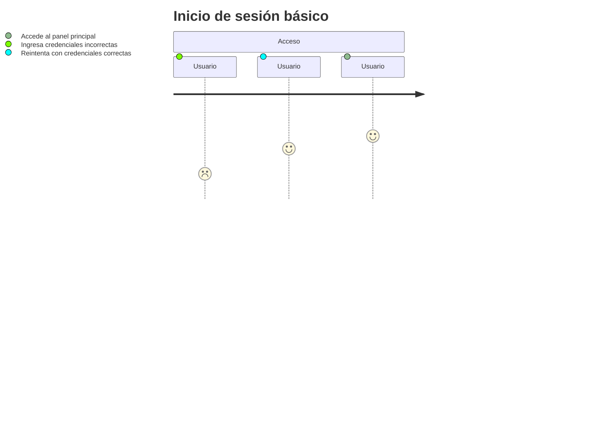
**Errores comunes evitados**: secciones con 3+ pasos coherentes; puntuación mejora tras resolver error.

### Nivel: Medio - Registro SaaS con doble factor
**Descripción**: Alta de cuenta y verificación MFA.
**Complejidad**: Medio
**Elementos clave**: MFA, correo transaccional, fallback SMS.
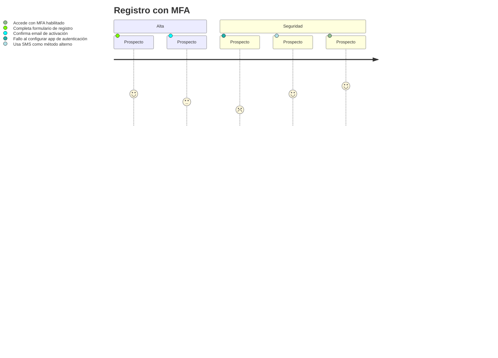
**Errores comunes evitados**: separa onboarding funcional de seguridad; muestra camino de recuperación.

### Nivel: Medio - Compra e-commerce web
**Descripción**: Journey completo desde búsqueda a pago.
**Complejidad**: Medio
**Elementos clave**: filtros, carrito, gateway pago.
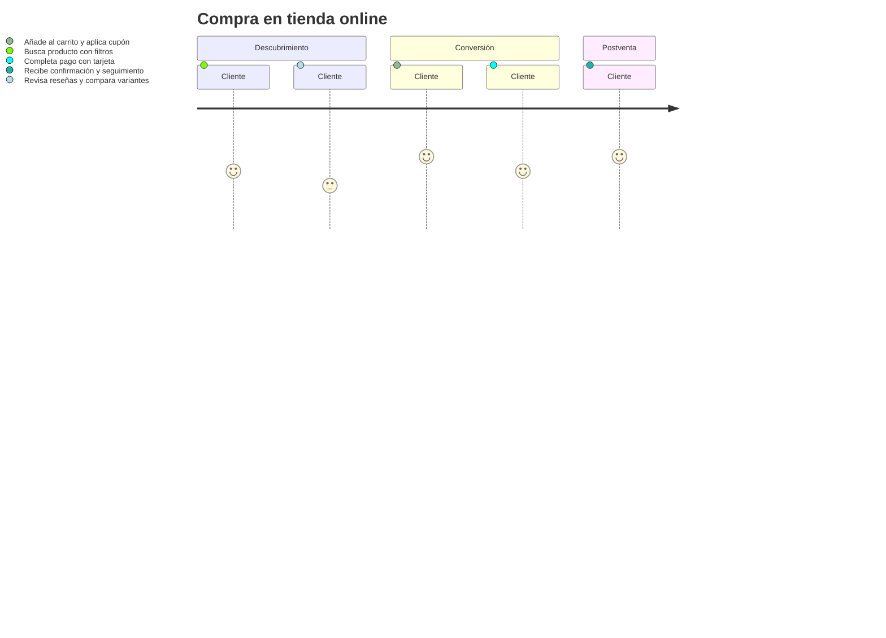
**Errores comunes evitados**: balance de secciones; incluye etapa de postventa para métricas NPS.

### Nivel: Medio - Soporte en mesa de ayuda
**Descripción**: Ticketing con escalamiento.
**Complejidad**: Medio
**Elementos clave**: SLA, comunicación proactiva.
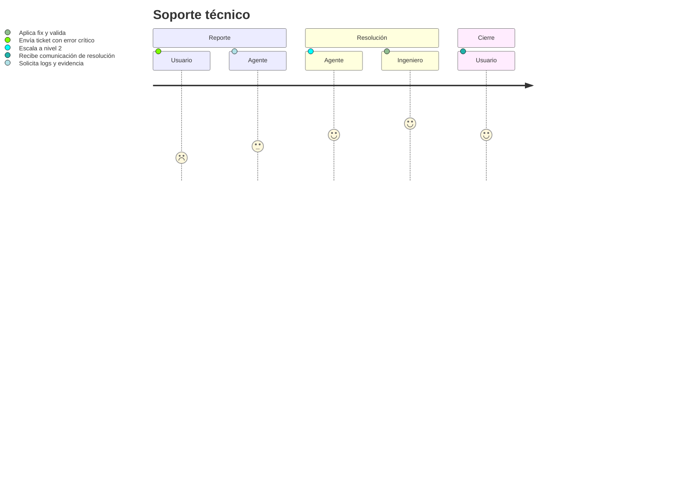
**Errores comunes evitados**: actores distintos por rol; cada sección con responsabilidad clara.

### Nivel: Complejo - Onboarding multi-actor (Banca)
**Descripción**: KYC y activación de cuenta.
**Complejidad**: Complejo
**Elementos clave**: verificación identidad, revisión manual, activación multicanal.
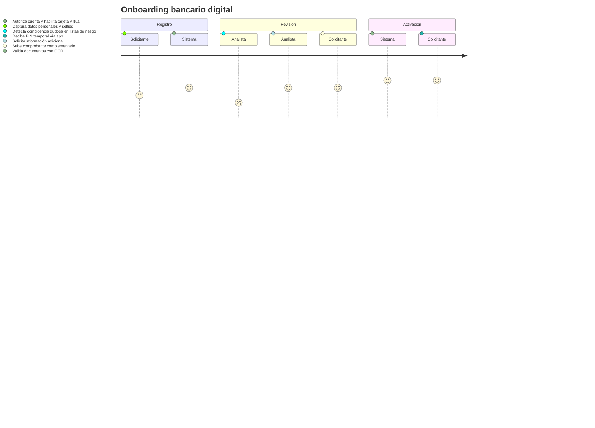
**Errores comunes evitados**: mezcla de actores humanos y sistemas; decisiones de riesgo reflejadas en puntuación.

### Nivel: Complejo - Onboarding SaaS B2B
**Descripción**: Setup con data import y capacitación.
**Complejidad**: Complejo
**Elementos clave**: migración CSV, roles admin/usuario, entrenamiento.
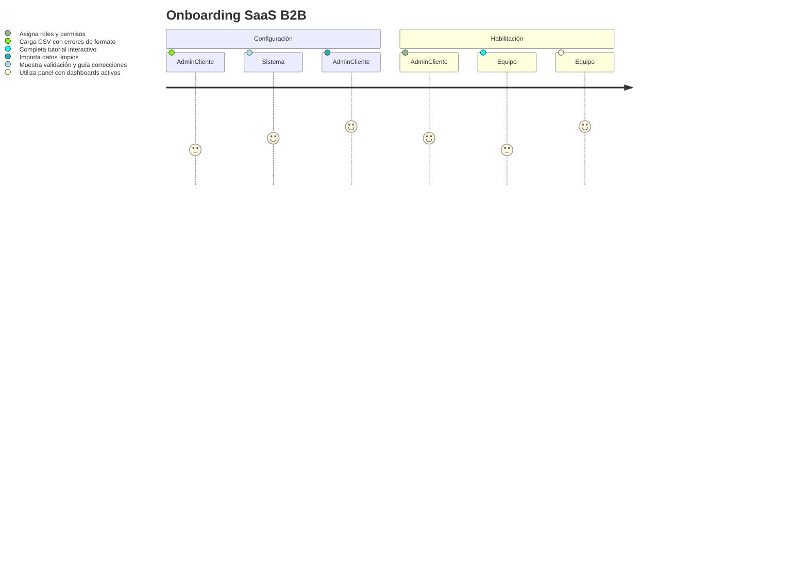
**Errores comunes evitados**: destaca corrección de datos; rol administrativo separado del equipo.

### Nivel: Complejo - Banca móvil con recobro
**Descripción**: Flujo de pago recurrente y recuperación.
**Complejidad**: Complejo
**Elementos clave**: pago automático, error, reintento seguro.
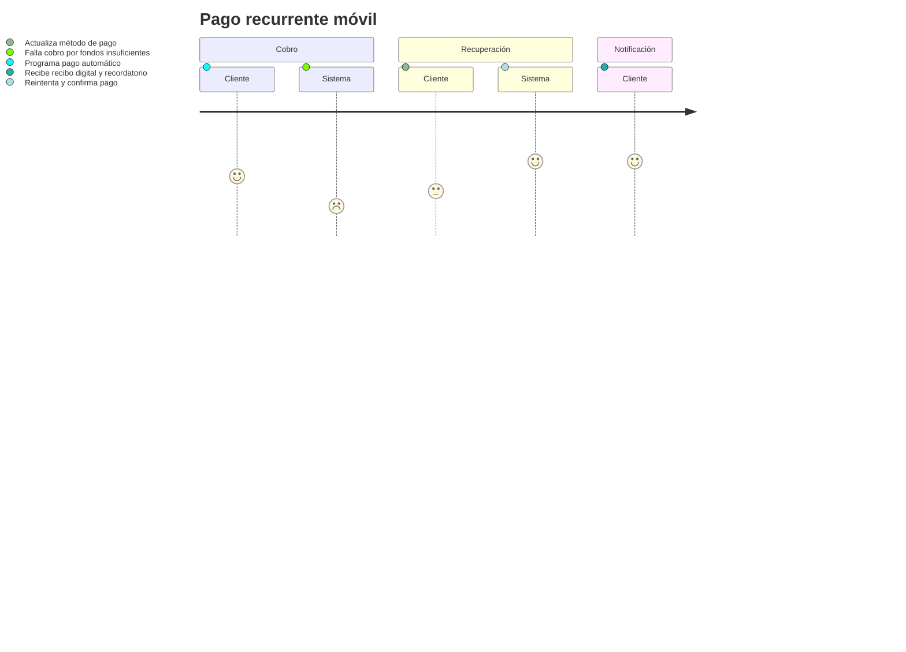
**Errores comunes evitados**: incluye camino de error y recuperación explícitos.

### Nivel: Experto - Healthcare telemedicina
**Descripción**: Consulta remota con seguimiento clínico.
**Complejidad**: Experto
**Elementos clave**: triage, receta electrónica, monitoreo continuo.
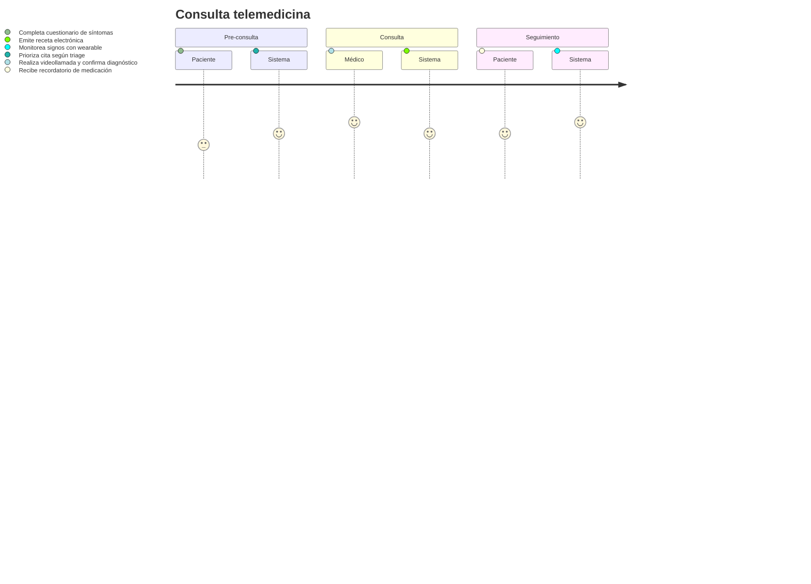
**Errores comunes evitados**: diferencia entre acciones clínicas y automáticas; puntuaciones alineadas a bienestar.

### Nivel: Experto - Logística con multicanal
**Descripción**: Última milla y atención al cliente omnicanal.
**Complejidad**: Experto
**Elementos clave**: tracking en tiempo real, chat, reintento de entrega.
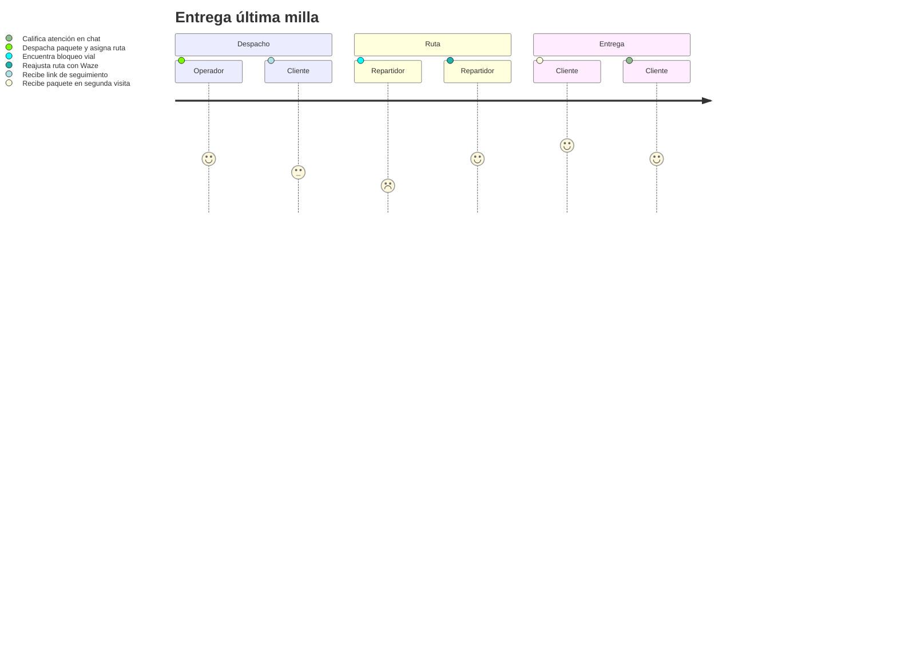
**Errores comunes evitados**: muestra variación de satisfacción por eventos externos; segundo intento visible.

### Nivel: Experto - SaaS con emociones y métricas
**Descripción**: Journey multi-canal con NPS.
**Complejidad**: Experto
**Elementos clave**: web, móvil, soporte; puntuaciones reflejan emoción.
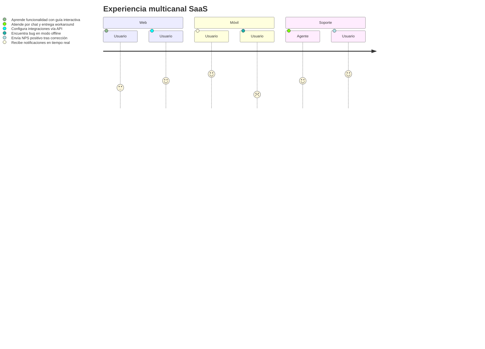
**Errores comunes evitados**: relaciona puntuaciones con emociones; muestra impacto de soporte en NPS.

### Nivel: Experto - Recuperación ante incidentes (SRE)
**Descripción**: Flujo de incident response con postmortem.
**Complejidad**: Experto
**Elementos clave**: severidad, canales de comunicación, aprendizaje.
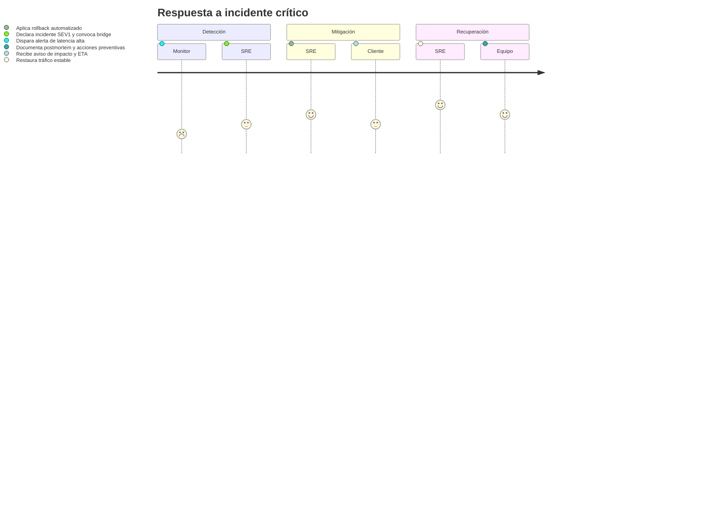
**Errores comunes evitados**: enfatiza comunicación con clientes; cierra con aprendizaje.

## Checklist final antes de compartir
- Título y secciones describen claramente el contexto.
- Cada paso incluye Actor + Puntuación (1-5) + Acción.
- Secciones no vacías y con mínimo dos pasos.
- Puntuaciones reflejan emoción realista (errores con 1-2, éxitos con 4-5).
- Los actores mantienen el mismo casing en todo el diagrama.
