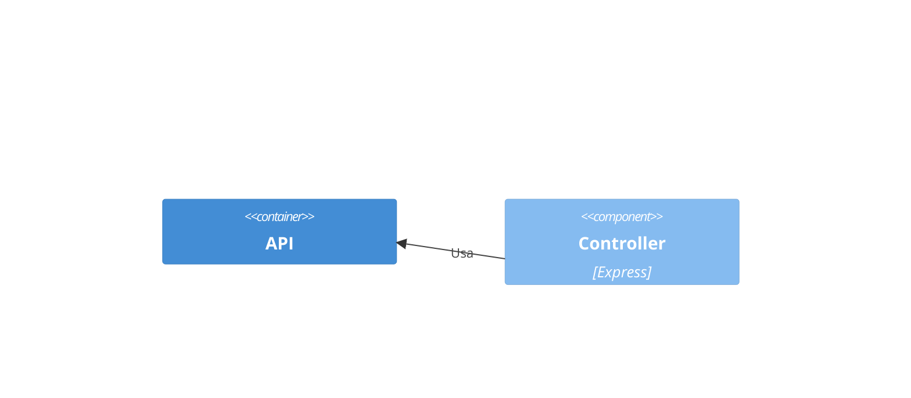
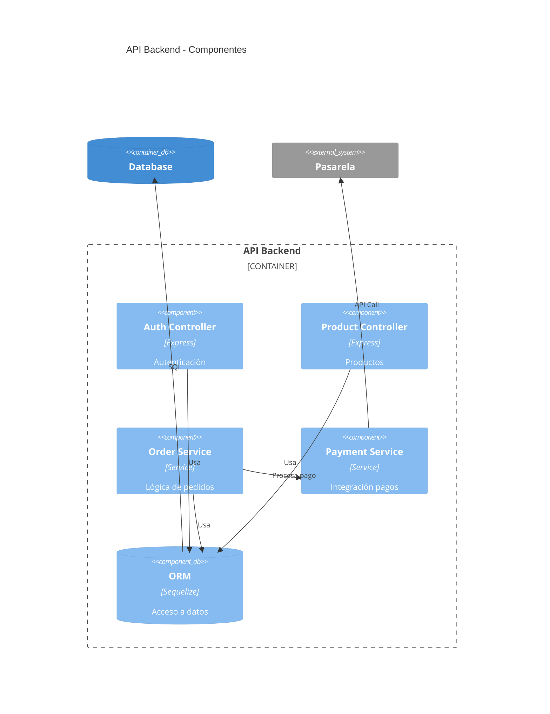
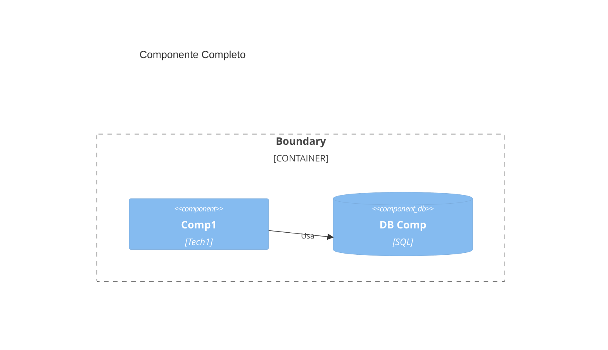

# Diagramas C4 Component en Mermaid

## Sintaxis Básica (Oficial)
`C4Component` para nivel 3. 
Elementos: Component(alias, "Label", "Tech").

## Errores Más Comunes
- Componentes sin contenedor padre.
- Relaciones sin tecnología.

## Ejemplos
### Simple (Oficial)

### Medio (Del Original)

### Complejo (Complemento)

## Buenas Prácticas
- Muestra lógica interna de contenedores.
- Usa SOLID.
- Del original: Enfócate en módulos reutilizables.