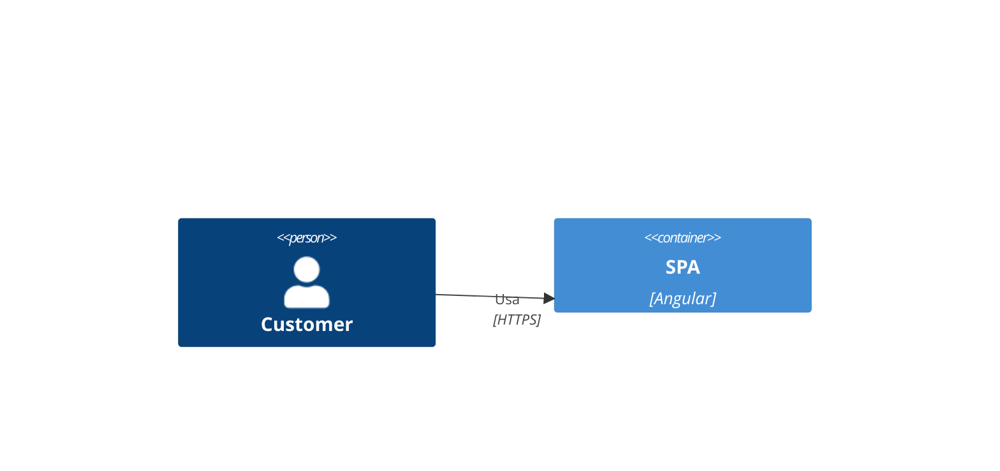
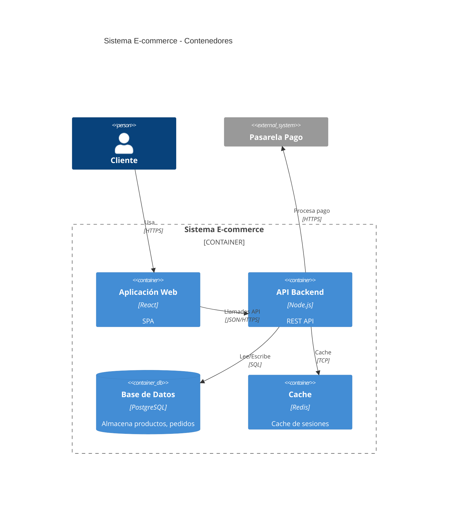
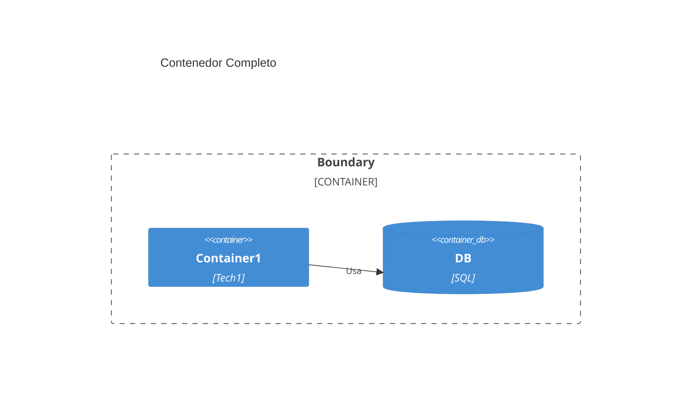

# Diagramas C4 Container en Mermaid

## Sintaxis Básica (Oficial)
`C4Container` para nivel 2. Elementos: Container(alias, "Label", "Tech").

## Errores Más Comunes
- Contenedores sin tecnología.
- Relaciones sin etiqueta.

## Ejemplos
### Simple (Oficial)

### Medio (Del Original)

### Complejo (Complemento)

## Buenas Prácticas
- Incluye tecnología en contenedores.
- Muestra fronteras de sistemas.
- Del original: Enfócate en aplicaciones/servicios.