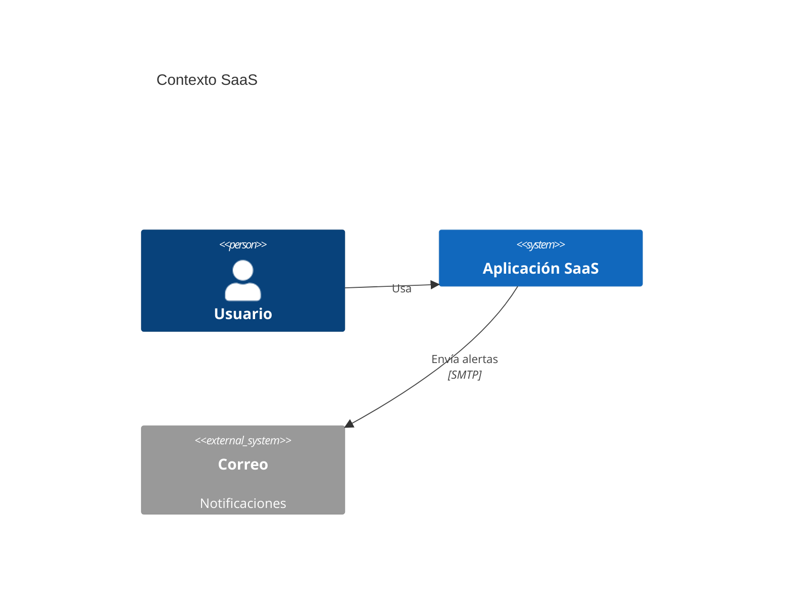
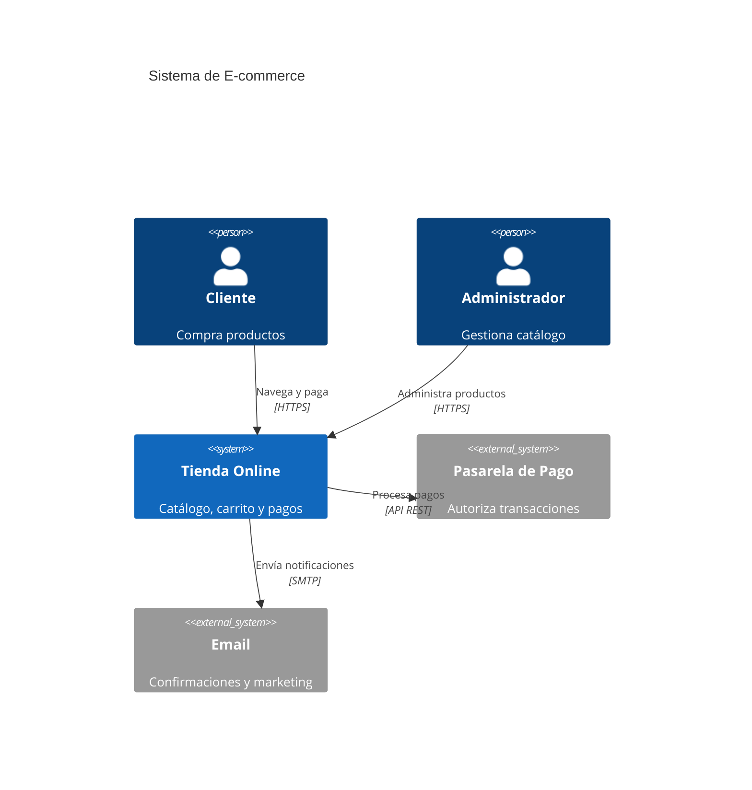
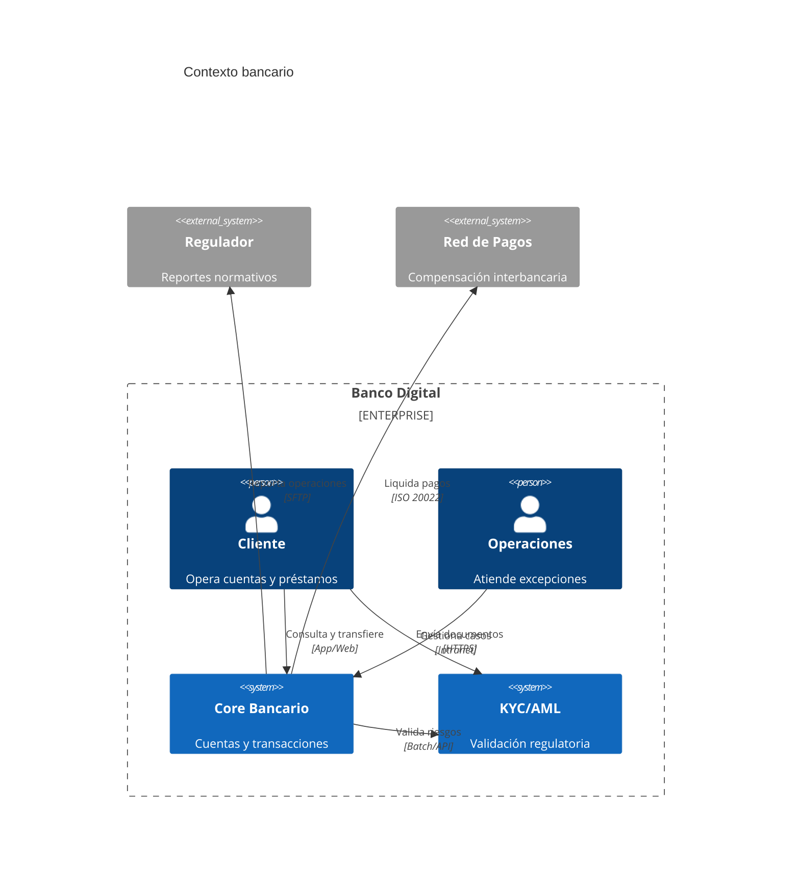
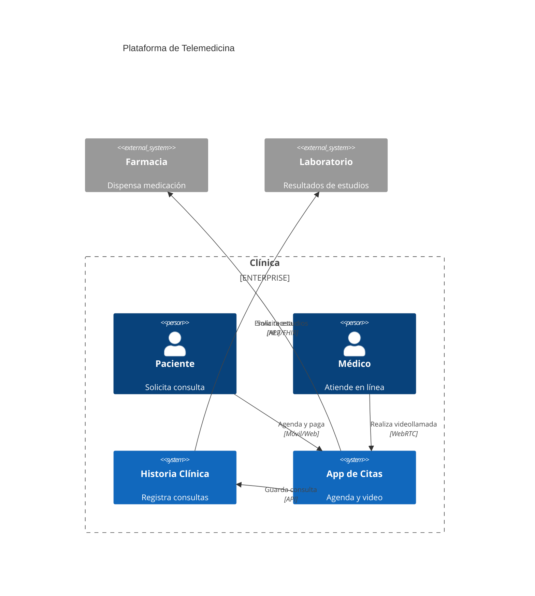
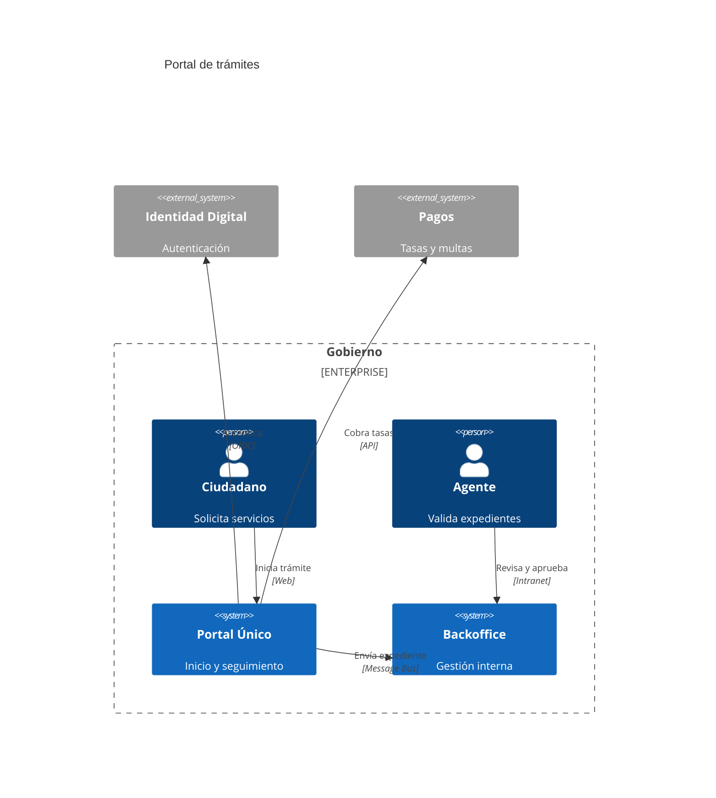
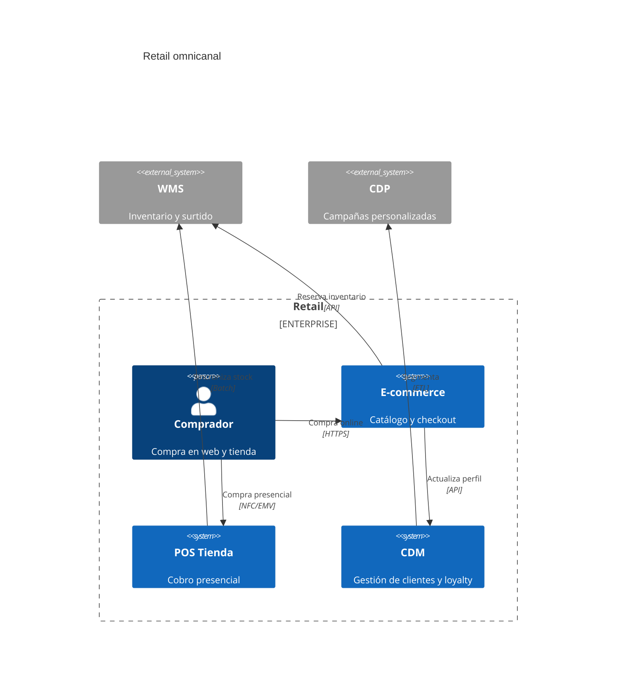
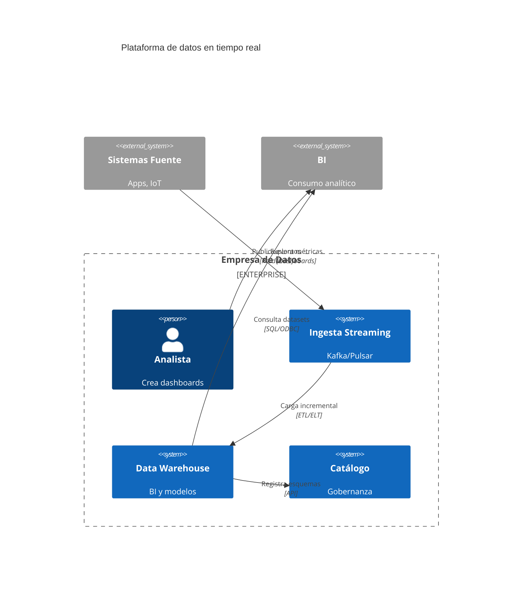
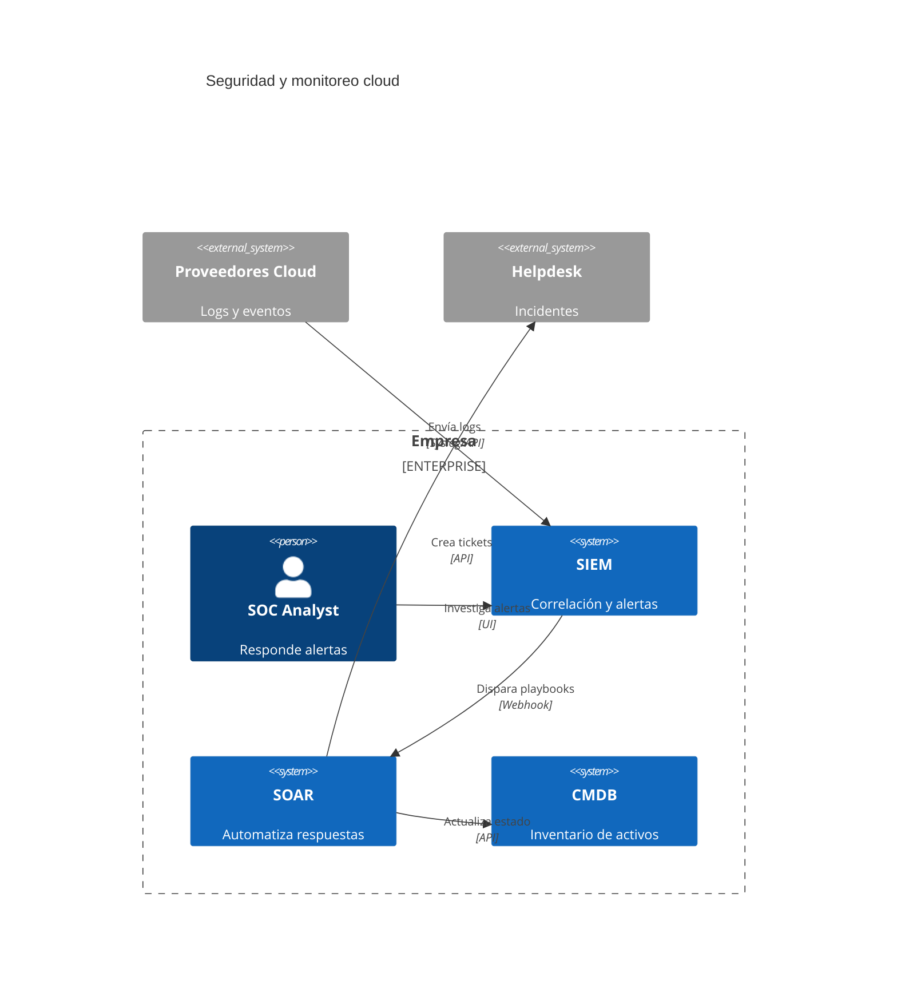
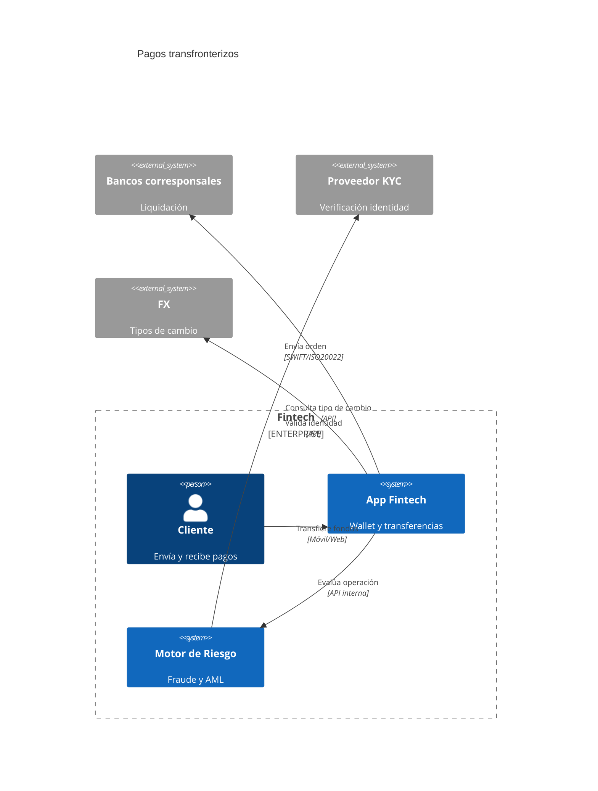

# Diagramas C4 Context en Mermaid

Nivel 1 del modelo C4. Describe actores y sistemas involucrados, sin detallar componentes internos.

## Sintaxis completa
```mermaid
C4Context
    title [Título opcional]
    Person(alias, "Etiqueta", "Descripción")
    System(alias, "Etiqueta", "Descripción")
    System_Ext(alias, "Etiqueta", "Descripción")
    Enterprise_Boundary(id, "Nombre") { ... }
    Rel(origen, destino, "Relación", "Protocolo")
```

### Errores frecuentes
- Olvidar cerrar llaves de `Enterprise_Boundary`.
- Referenciar aliases no definidos en `Rel`.
- Mezclar mayúsculas/minúsculas creando actores duplicados.
- Abusar de detalles técnicos (puertos, tablas) que pertenecen a niveles inferiores.

## Ejemplos

### Simple - SaaS genérico


### Medio - E-commerce con pasarela y email


### Complejo - Banco digital con regulación


### Complejo - Salud (telemedicina)


### Complejo - Gobierno electrónico


### Complejo - Retail omnicanal


### Experto - Plataforma de datos (streaming)


### Experto - Seguridad y monitoreo


### Experto - Fintech pagos internacionales


## Buenas prácticas
- Usa títulos y descripciones breves orientadas al usuario y objetivo del sistema.
- Aísla sistemas externos con `System_Ext` para clarificar dependencias y responsabilidades.
- Usa `Enterprise_Boundary` para mostrar dominios/regiones (negocio vs terceros).
- Mantén protocolos en las relaciones solo si aportan claridad (HTTPS, API, Batch).
