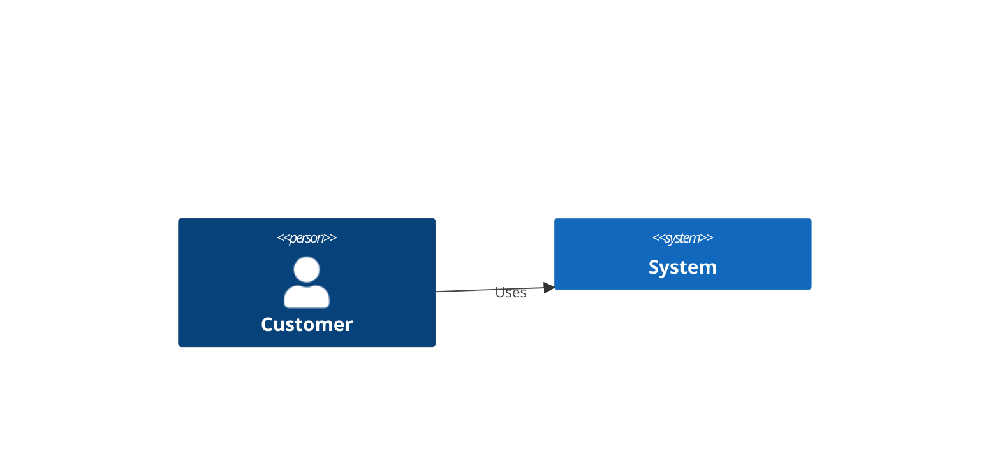
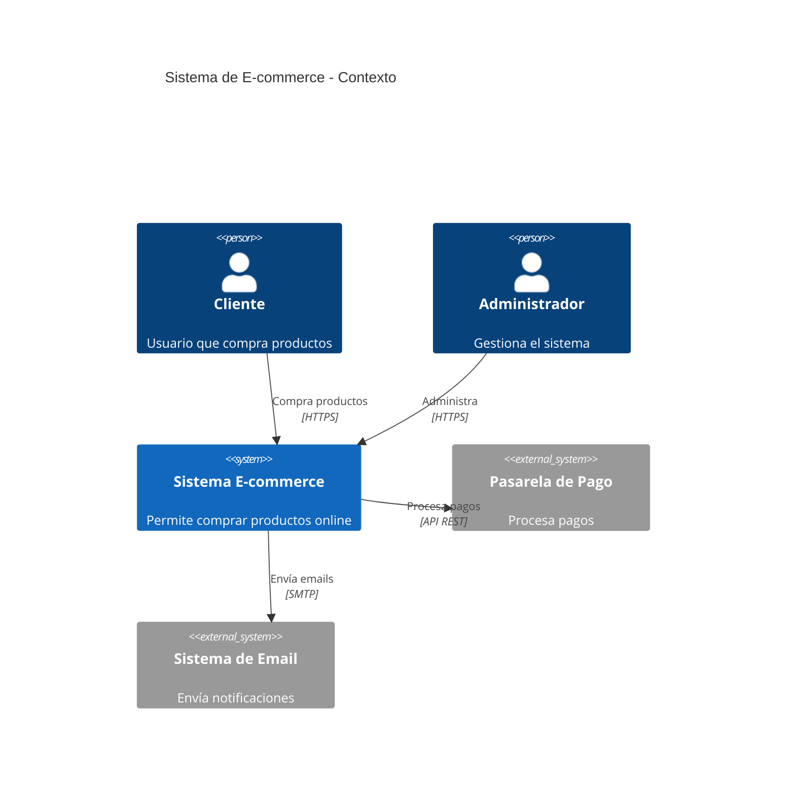
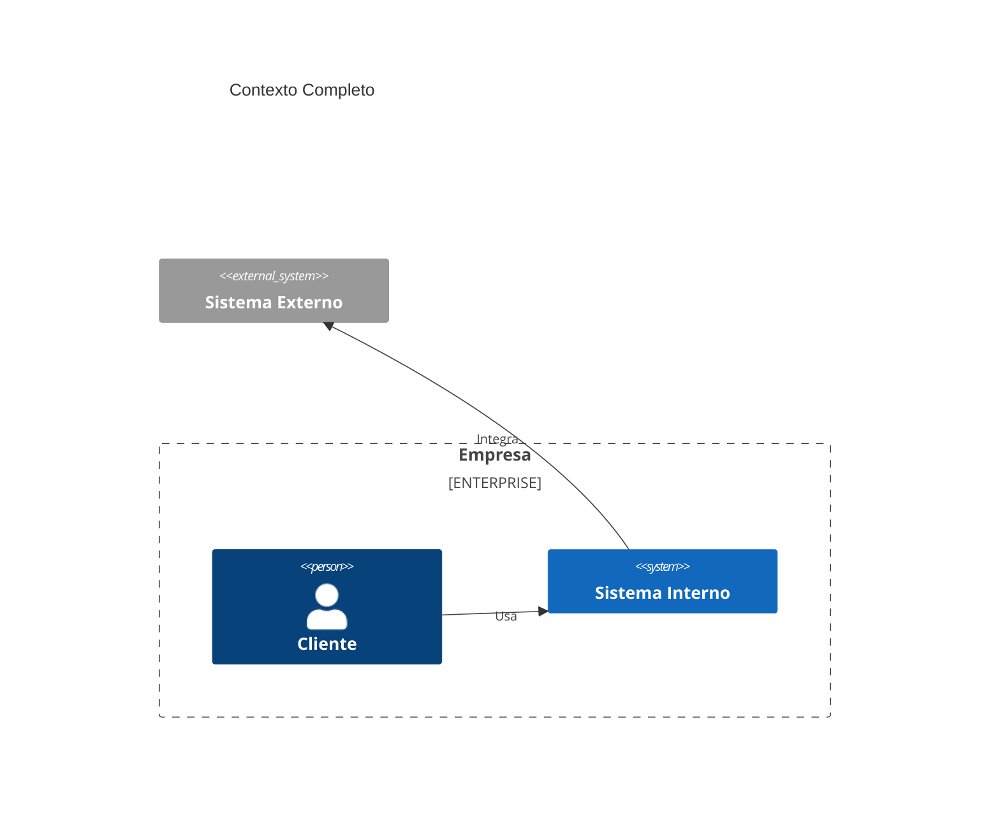

# Diagramas C4 Context en Mermaid

## Sintaxis Básica (Oficial)
`C4Context` para nivel 1. 
Elementos: Person(alias, "Label"), 
System(alias, "Label").

## Errores Más Comunes
- Missing braces for boundaries.
- Relaciones a elementos no definidos.
- Del original: Usar Node() en lugar de Person/System.

## Ejemplos
### Simple

### Medio

### Complejo

## Buenas Prácticas
- Muestra actores externos.
- Usa boundaries para agrupar.
- Del original: Enfócate en "qué" no "cómo".