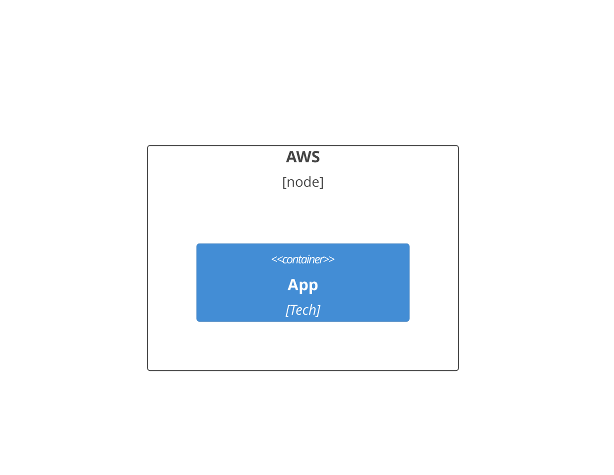
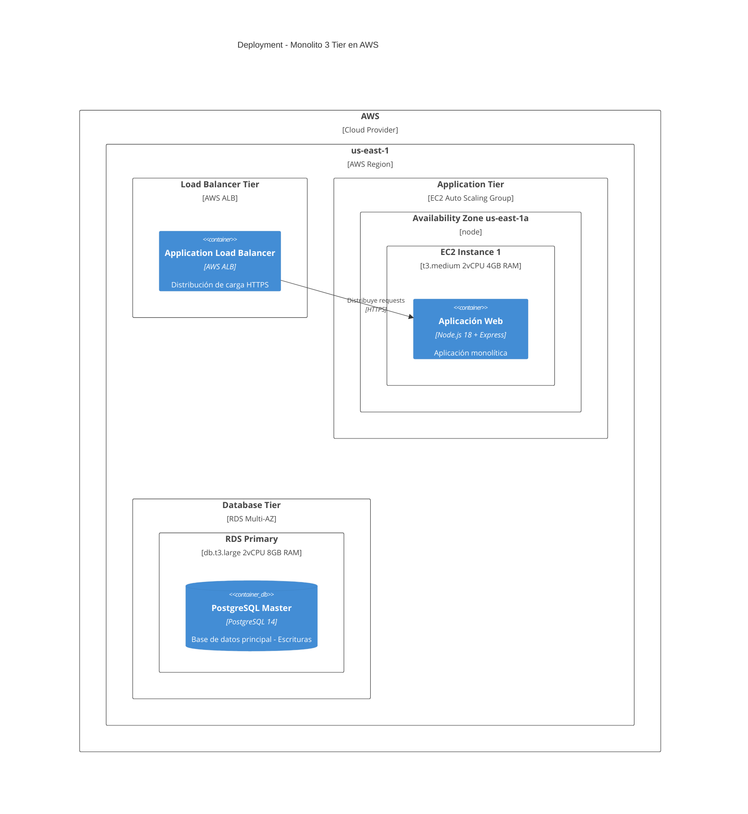
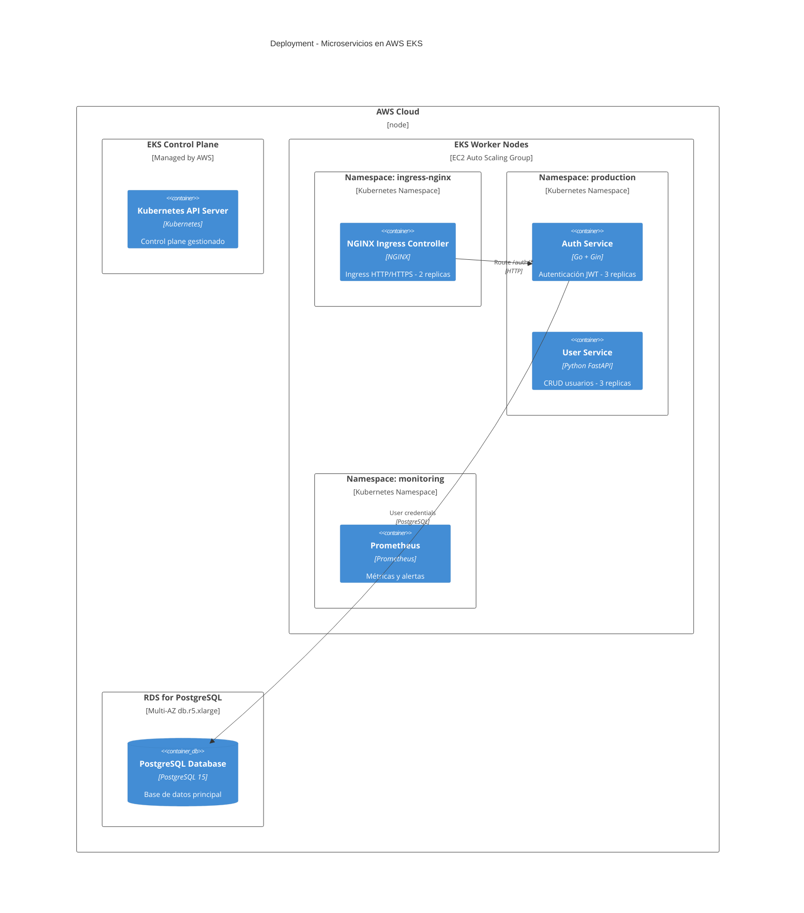

# Diagramas C4 Deployment en Mermaid

## Sintaxis Básica (Oficial + Original Verificada)
`C4Deployment`. Nodos: Deployment_Node(alias, "Label", "Type") { ... }. Contenedores: Container(alias, "Label", "Tech").

- Regla absoluta: Deployment_Node siempre con {} y al menos un hijo.
- No usar Node() solo; siempre con contenedor.

## Errores Más Comunes (Del Original)
- Deployment_Node sin {} o hijo: "Expecting 'LBRACE'".
- Llaves no balanceadas: "Parse error - Expecting '}'".
- Usar Node(): "Unknown diagram type".
- Relaciones a Deployment_Node en lugar de Container.

## Ejemplos
### Simple

### Medio

### Complejo

## Buenas Prácticas
- Siempre incluye hijos en Deployment_Node.
- Usa jerarquía: Cloud > Region > AZ > Server > Container.
- Del original: Verifica llaves balanceadas; relaciones a Containers no Nodes.
- Métricas: Capas <5; conexiones seguras 100%.