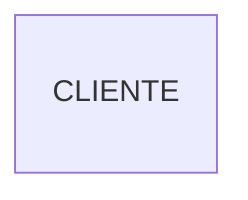
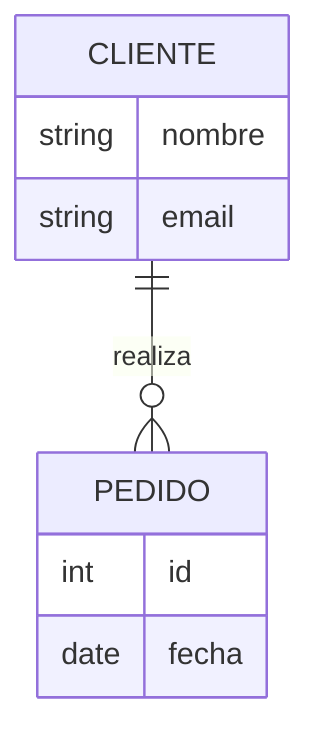
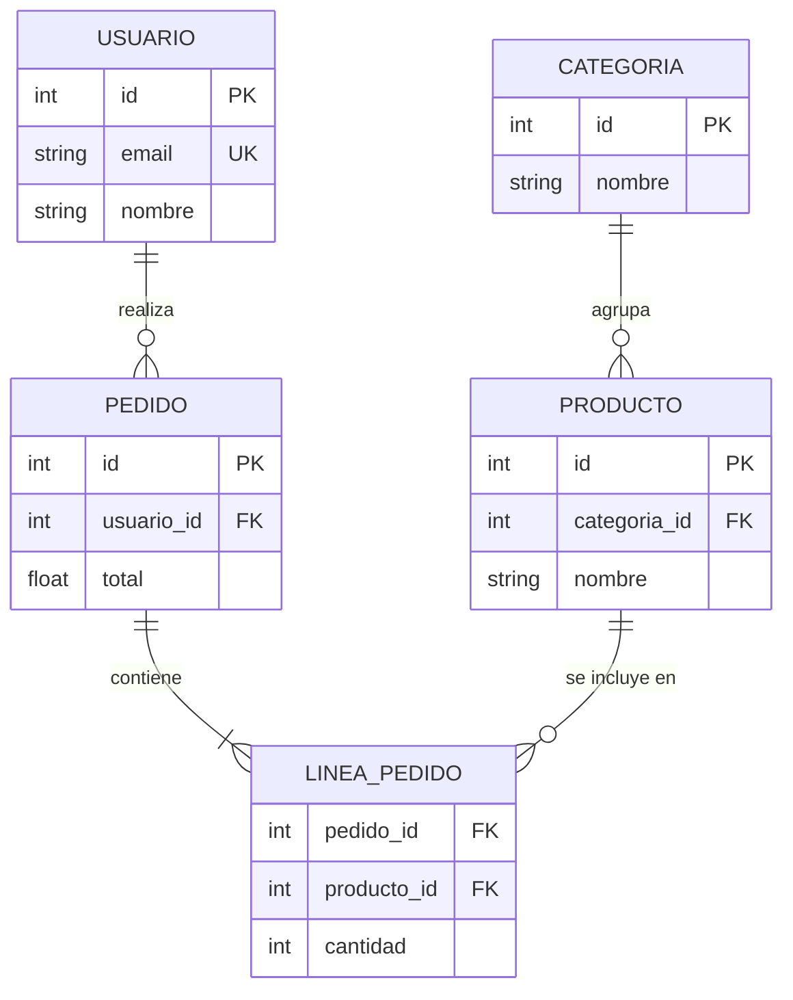

# Diagramas Entidad-Relación (E-R) en Mermaid

## Sintaxis Básica
Inicia con "erDiagram". 
Entidades: [Nombre] { tipo campo }. 
Relaciones: ||--o{ para 1 a muchos, con : "etiqueta".

## Cardinalidad (Oficial + Original)
- `||--||` : Uno a Uno
- `||--o{` : Uno a Muchos
- `}o--o{` : Muchos a Muchos

## Errores Más Comunes
- Relaciones sin etiqueta (: "rol").
- Tipos de datos inválidos (sin string/int).
- Cardinalidad incorrecta.
- Entidades sin campos.
- Del PDF: Relaciones no normalizadas.

## Ejemplos
### Simple (Oficial)

### Medio (Del Original + PDF)

### Complejo (Del Original)

## Buenas Prácticas
- Claves primarias/foráneas claras.
- Normalización (3NF).
- Asegura integridad referencial.
- Métricas: <10 entidades; relaciones descriptivas 100%.