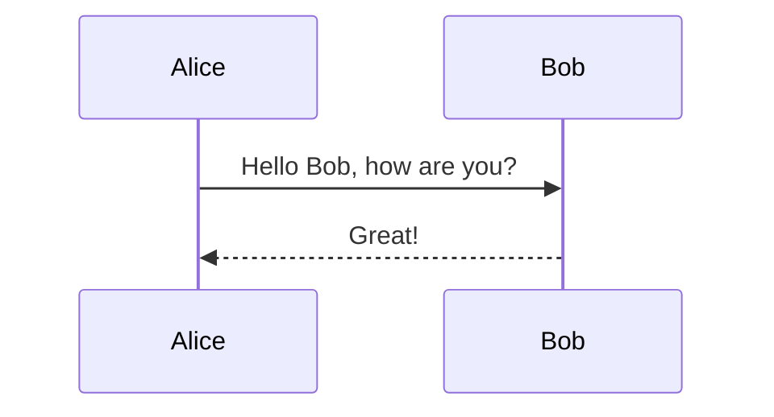
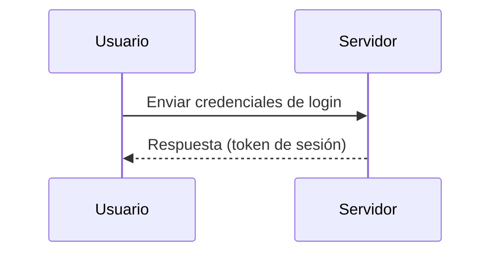
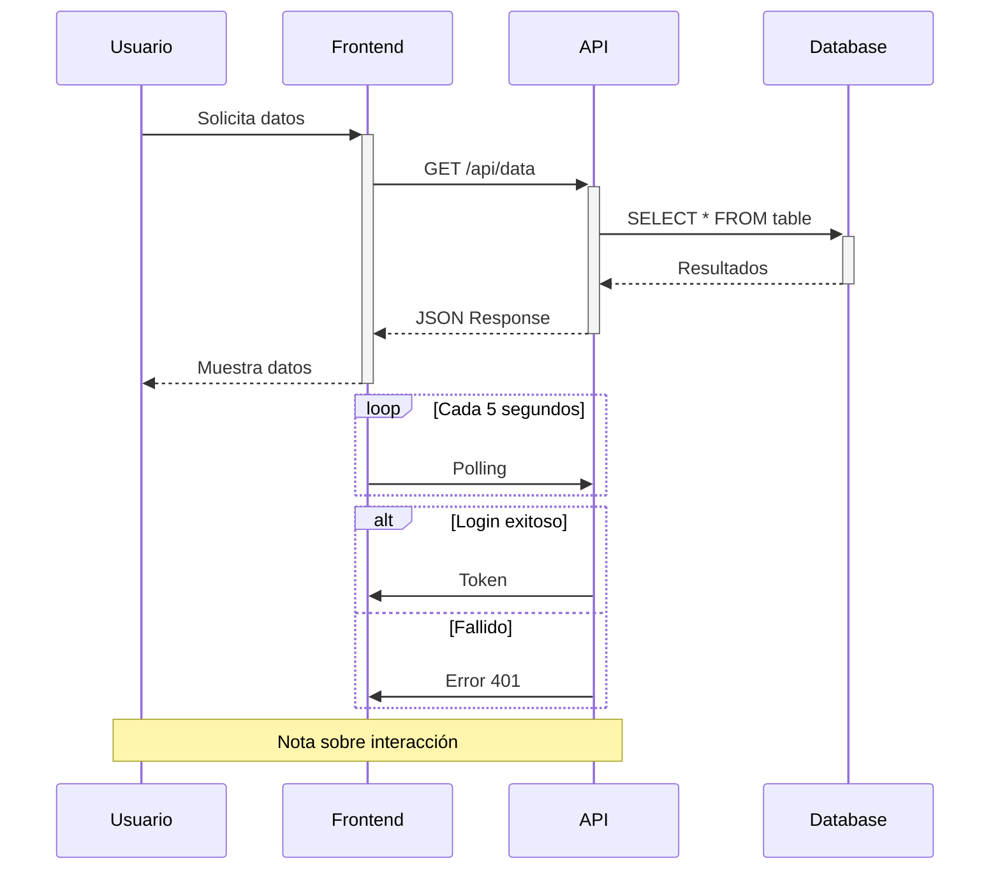

# Diagramas de Secuencia en Mermaid

## Sintaxis Básica
Inicia con "sequenceDiagram". 
Participants: participant [Actor]. 
Mensajes: ->> para llamadas, -->> para respuestas. 
Bloques: alt [Condición] ... end.

- Del original: `participant U as Usuario`.

## Tipos de Flechas (Oficial + Original)
| Sintaxis | Tipo | Uso |
|----------|------|-----|
| `->>`  | Sólida | Llamada síncrona |
| `-->>`  | Punteada | Respuesta |
| `->>+` | Activación | Inicia proceso |
| `-->>-` | Desactivación | Termina proceso |
| `-x` | Con X | Llamada perdida |

## Elementos Avanzados (Oficial + Original)
- Loops: `loop [Label] ... end`
- Alternativas: `alt [Condición] ... else ... end`
- Opcionales: `opt [Condición] ... end`
- Paralelos: `par [Label] ... and ... end`
- Notas: `Note right of [Actor]: Text`

## Errores Más Comunes
- Participants no declarados primero.
- Flechas incorrectas (e.g., --> en lugar de ->>).
- Bloques alt sin end.
- Mensajes sin actor destino.
- Activaciones no balanceadas (+ sin -).
- Usar -->> para respuestas sin llamada previa.

## Ejemplos
### Simple

### Medio

### Complejo

## Buenas Prácticas
- Declara participants al inicio.
- Usa activaciones para mostrar duración.
- Añade notas para aclaraciones.
- Incluye alternativas para ramificaciones; verifica cronología.
- Métricas: <20 interacciones; incluye errores.