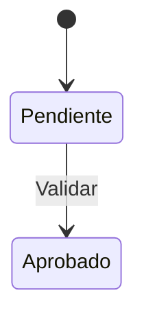
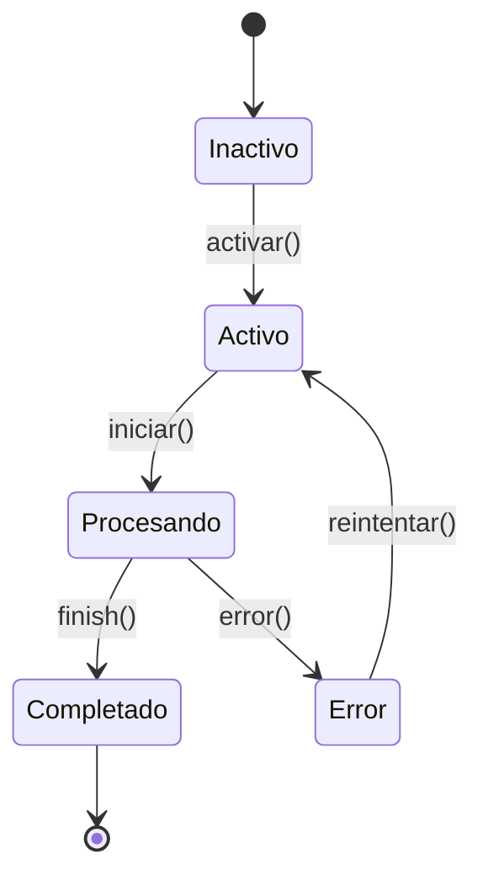
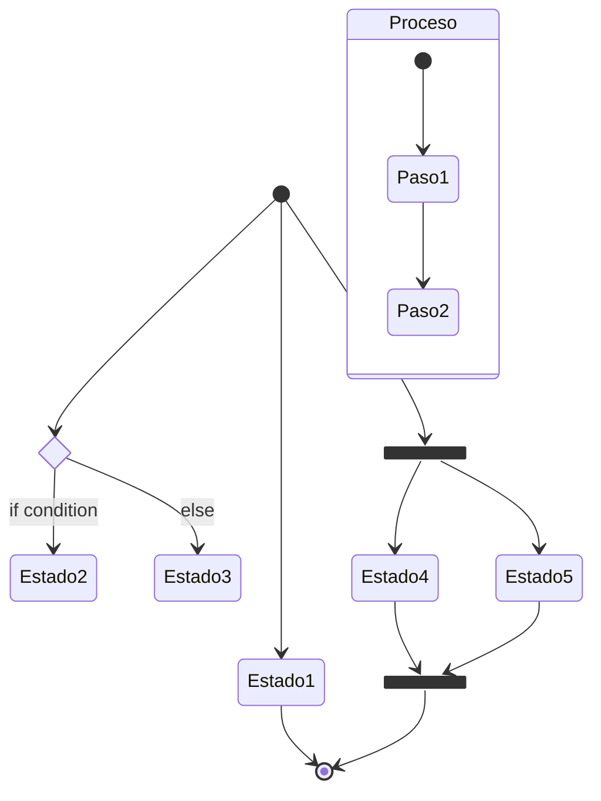

# Diagramas de Estado en Mermaid

## Sintaxis Básica
Inicia con "stateDiagram-v2". 
Estados: [*] --> [Estado]. 
Transiciones: --> : "etiqueta". 
Compuestos: state "Grupo" { ... }.

- Del original: Usa -v2 para nuevo renderer.

## Estados Especiales (Oficial + Original)
- `[*]` Inicio/Fin.
- `<<choice>>` Decisión.
- `<<fork>>` Paralelización.
- `<<join>>` Sincronización.

## Errores Más Comunes
- Olvidar -v2 en keyword.
- Transiciones sin etiqueta.
- Estados sin [*] para inicio/fin.
- Compuestos sin cierre.
- Transiciones con dead-ends.

## Ejemplos
### Simple (Oficial)

### Medio (Del Original)

### Complejo (Del Original + Oficial)

## Buenas Prácticas
- Cubre todos paths sin dead-ends.
- Incluye estados de error.
- Usa compuestos para lógica compleja.
- Métricas: <8 estados; transiciones lógicas 100%.