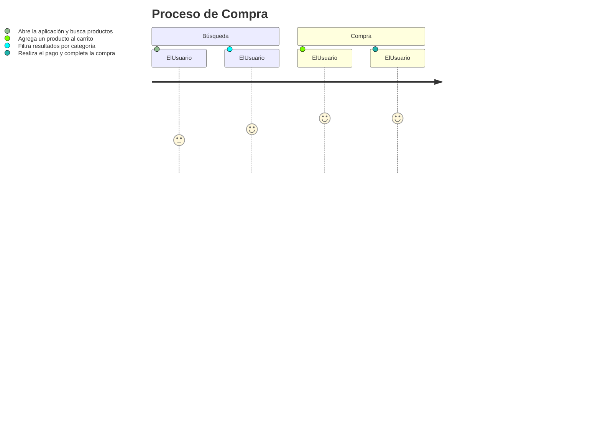
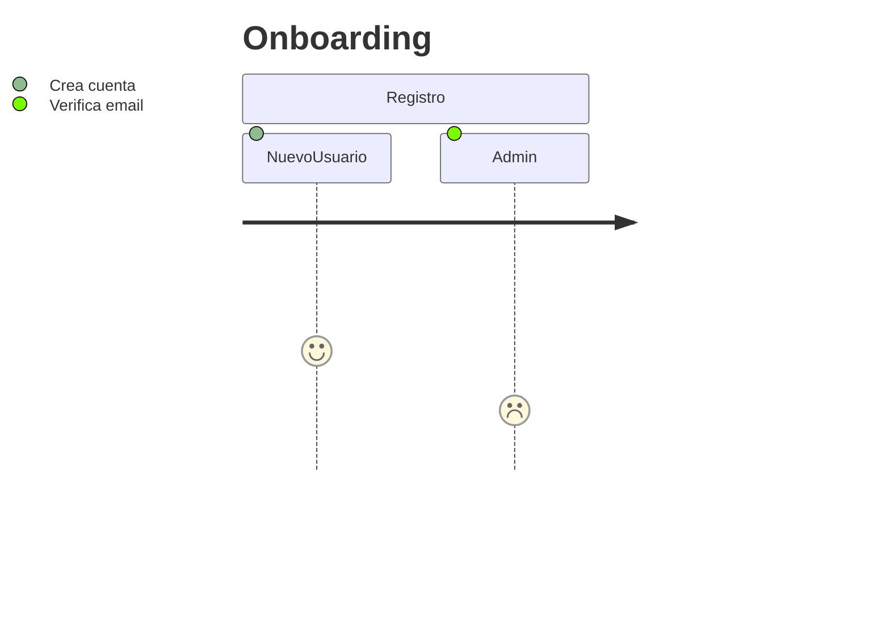

# Diagramas de User Journey

Sintaxis Básica:
journey
    title [Título]
    section [Sección]
        Actor: Puntuación: Tarea
        // Puntuación: 1-5 (satisfacción)

## Ejemplo (del PDF):

## Ejemplo Avanzado: Con Múltiples Actores

Checklists:
- Desarrollo: Incluye touchpoints UI/UX.
- Integración: Conecta con APIs externas.
- Métricas: Puntuación media >3; pasos <10 para usabilidad.